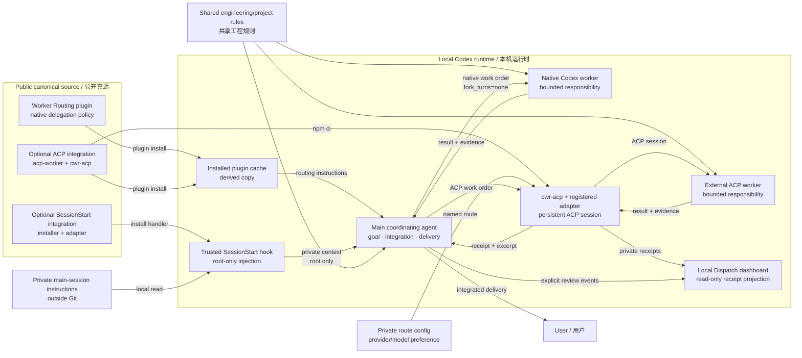

# Codex Worker Routing

[中文](README.md) | English

Hand one complete engineering responsibility to a native Codex worker while the main
agent keeps ownership of the goal, integration, and delivery. It suits users who have
already connected more than one model and want to distribute execution work while
keeping their main-session personal context intact.

This is an early-stage implementation. Routing is provided by an instruction-only
plugin; the optional ACP integration connects a registered external coding agent through
`acpx/runtime`; and the optional main-session integration uses a native `SessionStart`
hook to load local private instructions automatically. There is no additional MCP
server, job database, provider proxy, or fixed planner/tester/reviewer pipeline.

## Dispatch

Home opens with aggregate statistics: activity over time, execution results and optional review notes, route distribution and revision reasons. Individual replays live in Records.

Give everyday collaboration a visible trail: inspect ACP workload by period, replay one
worker's continuations, submissions, revisions, acceptance and takeovers, and distinguish
coordinator verification from worker-reported evidence. The local dashboard ships four themes, each pairing a
paper palette with a sibling animal: the default "Sage cat / 鼠尾草猫" (the folded-ear cat is that Canon
identity), plus "Oat bunny / 燕麦玫瑰兔", "Mist puppy / 雾蓝奶油狗" and "Lilac bear / 薰衣草杏熊".
The palette recolours the dashboard and its charts, while the companion appears on the overview sticker and the
share seal. The choice is remembered in same-origin `localStorage` and restored on refresh; the export dialog
opens with the dashboard's theme each time and lets you pick a different one for the artifact alone.
Chinese / English and landscape / portrait stay independent. Exports keep to an
aggregate-only allowlist and are named `worker-routing-THEME-LANGUAGE-FORMAT-DATE.ext`: no work orders, private
route names, paths or internal IDs. The Canon identity is the folded-ear cat together with the default sage
palette: the header mark, favicon and the share header keep that one vector and those colours in every theme,
and the standalone logo download is always that cat.

Statistics read execution receipts automatically. Ordinary completion needs no review stamp and creates
no to-do. `continue --revision-reason` optionally records a real correction; on-demand `pending`
lists execution issues and explicitly requested follow-up.

```sh
node integrations/acpx/src/cli.mjs dashboard --config /absolute/private/routes.json
node integrations/acpx/src/cli.mjs stats --config /absolute/private/routes.json --since 7d
```

It is read-only, loopback-only and on demand, with no analytics or additional frontend
dependency. Cumulative tokens are deduplicated with explicit coverage; missing data stays
unknown. Runtime completion is not acceptance, and observed workload is not an estimate of
Codex quota saved. Coverage is explicitly ACP-only. See the [Dispatch guide](docs/dispatch.en.md).

## Architecture



The diagram separates public source, the derived installed copy, private instructions
outside Git, and the optional ACP execution channel. It shows input assembly and
responsibility flow: `fork_turns="none"` omits the main conversation history, but it does
not remove engineering rules attached by the host or create a file-access sandbox.
Temporary native, ACP, provider, and model priorities belong in operator configuration
outside Git; the repository does not choose them for the user.

## First Setup

If you have not completed one delegated task end to end, start with
[from zero to a first successful delegated task](docs/first-delegated-task.en.md). It
separates model/provider access, native subagents, the Worker Routing plugin, the
optional ACP route, and coordinator acceptance, then gives three independent setup
paths and a troubleshooting table.

To add an API model to the native Codex model picker, use the
[custom native model picker guide](docs/native-model-picker.en.md). It covers both a
direct Responses-compatible endpoint and several upstreams behind one local
router/proxy. Provider keys, subscription priorities, and fallback policy remain in
operator-owned configuration outside Git and never become Worker Routing policy.

ACP route reachability has a separate protocol boundary: the channel carries sessions,
lifecycle, permissions, and evidence, but it does not translate provider wire formats.
For why a route or model can initialize while inference still fails, see
[the ACP channel and provider-protocol boundary](docs/acp-provider-protocols.en.md).

For one concrete end-to-end example, see
[using the Command Code Provider API through Codex Router](docs/commandcode-via-codex-router.en.md):
it turns an upstream Chat Completions API into the Responses shape Codex needs via a local
Codex Router, and optionally reuses that same router for an isolated ACP worker route.

## Everyday Use

After installation, just ask for engineering work as usual. The main agent hands over a
complete responsibility when that pays off: investigation, implementation, self-testing,
and the necessary documentation can be completed coherently by the same worker, and a
correction continues in the same child.

```text
修复 CSV 导入时空行导致的失败，补能复现问题的检查。
可以把导入模块的调查、修复和自测交给一个 worker；你负责整合与最终交付。
```

`全权接住` and `从头做到位` permit internal delegation; `solo`, `亲自做`, and
`别派小弟` keep the main agent executing. Tiny work, nearly finished work, or work whose
handover cost is too high is completed directly as well. After delegating, the main
agent does not re-implement the same responsibility, does not spawn a separate reviewer
by default, and continues the same child for corrections.

Delegation order is to protect the complete result, its quality, and the applicable
permissions first, then reduce execution consumption on the main subscription without
sacrificing those three, while keeping end-to-end duration and coordinator rework under
control. Use a route the operator has already specified and authorized, one that suits
the responsibility and consumes less of the main subscription quota; do not delegate
for the sake of dividing work when no known benefit exists. External worker API spend is
accounted separately, with no silent fallback to a higher-cost route. Model and provider
names stay in operator configuration; the plugin keeps no leaderboards, price lookups,
or evaluation matrices. An optional ACP route performs no automatic fallback: only the
current task authority and operator policy may decide whether to switch routes after a
failure.

## Behavior Scenarios

Four non-runtime observation scenarios and their evidence standards are recorded in
[behavior scenarios](docs/behavior-scenarios.md): a mid-sized fix requested in natural
language, the same child moving from investigation into implementation or local rework,
a healthy wait that neither cancels nor restarts anything, and solo or tiny work that is
not delegated. That page is a manual review record, not an evaluation platform, and it
makes no claim of stable triggering, net quota savings, low rework, or greater speed.

## How Context Is Separated

| Content | Main session | Temporary worker |
| --- | --- | --- |
| Shared engineering AGENTS and project rules | loaded automatically | loaded automatically |
| Local private main-session instructions | injected before the first model request by the optional SessionStart integration | not injected by that hook |
| The specific work order | organized by the main agent | received explicitly |
| Main conversation history | retained | new work orders use `fork_turns="none"` |

Adding a separate worker AGENTS file does not remove the private rules that are already
shared. To enable context separation, move the private content out of the automatically
shared AGENTS and first verify that the startup hook is trusted and arrives complete.
This is an input-assembly boundary, **not a file-access sandbox**.

The model and reasoning effort are determined by the user's live inventory and
authorization. The plugin does not bind to a vendor, provide API keys, change the main
model, or use a trial run to request permission for private data transfer.

## Installation

Open this repository in Codex and have the built-in plugin-creator install the plugin:

```text
Install this repository's plugins/worker-routing plugin into my personal
marketplace, and keep my current main model and provider configuration.
For updates, use the cachebuster and a normal reinstall.
```

After the personal marketplace registration is complete, the native commands are:

```bash
codex plugin add worker-routing@personal --json
codex plugin list --marketplace personal --json
```

To use an external ACP worker, install the optional integration:

```bash
cd integrations/acpx
npm ci --ignore-scripts
npm run check
npm run test:acpx
```

Keep route configuration, worker homes, adapters, and account state outside Git; see the
[ACP integration guide](docs/acp-integration.md) for commands and boundaries. When
private instructions need to be separated, follow
[installation and recovery](docs/installation.md) to connect the startup hook. That
integration is independent of the plugin; turning off the routing plugin does not turn
off main-session private instructions.

## Verification

The Python integration tests use only the standard library:

```bash
python3 -m unittest discover -s tests -p 'test_*.py'
python3 tests/native_context_probe.py --codex-bin "$(command -v codex)"

cd integrations/acpx
npm ci --ignore-scripts
npm run check
npm run test:acpx
```

The second command is an opt-in native process check and requires a binary that provides
the current multi-agent tools. It uses a temporary Codex home, synthetic instructions,
and a local scripted Responses service to verify the first root request, the child's
first work, continuation of the same child, and interrupt after completion. It does not
call a real model and cannot replace acceptance with an actual provider and actual
engineering execution. Codex itself may still try to fetch public plugin metadata, so
the process is not guaranteed to be fully offline.

The initial native compatibility basis is Codex `0.154.0-alpha.6.2`. The ACP
integration is pinned and verified against `acpx@0.15.1` and requires Node.js 22.13 or
newer. The real schema and adapter capabilities still govern at call time. Older CLIs or
other hosts may not provide the same fields. See [input boundaries](docs/context.md) and
the [ACP integration guide](docs/acp-integration.md) for more limitations.

This repository is the independent canonical source. The five native runtime documents
under `plugins/worker-routing` (`SKILL.md` and four references) are canonical in English;
`acp-worker` is the optional external-route entry. The native documents keep the trigger
examples `全权接住`, `从头做到位`, `solo`, `亲自做`, and `别派小弟`.
The Chinese `README.md`, [behavior scenarios](docs/behavior-scenarios.md), and the
installation and input-boundary documents remain in Chinese; this page is the English
companion for public readers.

**Provenance and scope.** This is an independently maintained, project-original workflow
project. Its initial routing policy was extracted by component scope from an internal
engineering workshop, and the independent repository is now the canonical source; the
workshop's Git history, adjacent projects, personal instructions, and working records
were not migrated. The repository contains hand-written routing and worker instructions, the native
SessionStart adapter, the installer, synthetic tests, user documentation, and an optional
integration built against the public `acpx/runtime` API. Responses and ACP test events
are local protocol fixtures with no real accounts, private requests, or model outputs;
no Codex runtime or external adapter implementation was copied. `acpx` and its transitive
dependencies retain their own third-party licenses.
The interface references OpenAI's [Hooks](https://learn.chatgpt.com/docs/hooks) and
[Subagents](https://learn.chatgpt.com/docs/agent-configuration/subagents) documentation
and independent observation of the local binary. This project is not an OpenAI official
product or a fork maintained by OpenAI.

**Privacy.** Personal instructions, account configuration, requests, and continuity are
not part of this repository. See [provenance](PROVENANCE.md).

## Licensing

Software and functional material are licensed under [`SUL-1.0`](LICENSE), which permits
personal, noncommercial, and internal business use; distribution or provision to others
must be free of charge and noncommercial. Documentation is licensed under
[`CC BY-NC-SA 4.0`](LICENSE-DOCUMENTATION.md), allowing noncommercial sharing and
adaptation with attribution and ShareAlike. This project is source-available and is
**not OSI open source**. [`LICENSING.md`](LICENSING.md) is the canonical path-level map.
