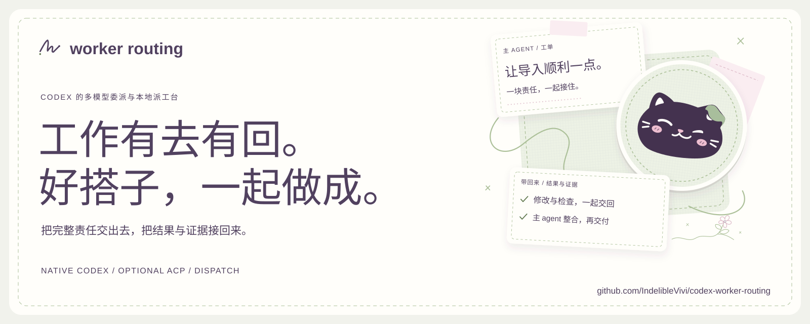
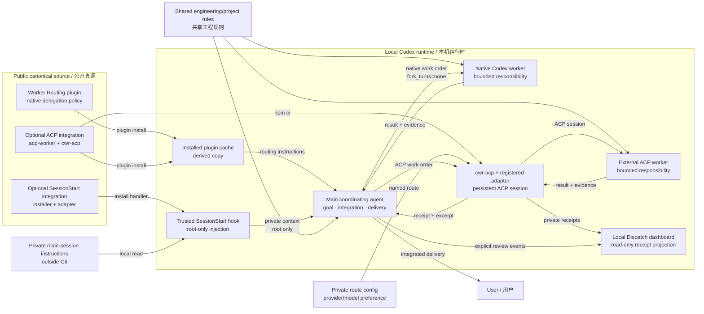

# Codex Worker Routing

[English](README.en.md) | 中文

把一块完整工程责任交给原生 Codex worker，主 agent 保留目标、整合与交付责任。
适合已接入多个模型、希望分配执行工作，同时保留主会话个人上下文的使用者。

这是初版实现。调度由一个 instruction-only plugin 提供；可选 ACP integration
通过 `acpx/runtime` 连接已登记的外部 coding agent；可选的主会话集成使用原生
`SessionStart` hook 自动加载本机私人说明。没有额外 MCP、job database、provider
proxy 或固定 planner/tester/reviewer 流水线。

## 产品页面与 Banner

双语产品页沿用鼠尾草、浅粉卡纸与折耳猫圆章，介绍委派流程和本地 Dispatch；
可直接切换四位伙伴、选择文案并下载合成示例分享卡。页面不连接私人派工台，
不读取回执，不使用 analytics。访问[中文产品页](https://indeliblevivi.github.io/codex-worker-routing/zh/)
或 [English](https://indeliblevivi.github.io/codex-worker-routing/)。
本地预览与发布方法见[产品页面指南](docs/website.md)。中英 Banner 位于
[`plugins/worker-routing/assets/`](plugins/worker-routing/assets/)。

## Dispatch · 派工台

Home 默认显示聚合统计：时间走势、准确占比的状态条、route 分工、明确返修与 runtime notes；具体工单回放在 Sessions。
Sessions 可按真实工作目录归入 Git 仓库或文件夹，同 repo 的 worktree 合并，再筛选具体目录；
不把这些归组冒充 Codex 保存的 project 名称。浏览器默认机器时区，日期柱、下钻与分享保持一致。

给日常协作留下一条看得见的轨迹：按时间窗口查看 ACP 工作量，展开同一 worker
的续做、送验、修正、接受与接管，分别检查主机验证和 worker 自述。本地面板提供四套纸张配色，
各配一只同族动物：默认「鼠尾草猫 / Sage cat」（折耳猫就是 Canon 身份），另有
「燕麦玫瑰兔 / Oat bunny」「雾蓝奶油狗 / Mist puppy」「薰衣草杏熊 / Lilac bear」。
配色应用到面板与图表，陪伴动物出现在首页标签与分享图圆章；主题、语言、时区保存在 Git 外的本地偏好文件，换端口或重启后恢复。
导出窗口每次从面板当前配色打开，可单独改配色而不影响面板，并可选择中文 / English 与横版 / 竖版，
生成 SVG、PNG 分享图；文件名形如 `worker-routing-THEME-LANGUAGE-FORMAT-DATE.ext`。
分享图把主任务数与布艺陪伴圆章组合成主视觉，分层展示执行轮次、已知用量与运行状态；仓库地址右对齐。
Slogan 可从四组双语文案开始自由编辑，支持可选分享者署名、三种数字字体，以及绕线 / 小花 / 留白装饰；
预览实时更新，中英文草稿分别保留在当前页面，刷新后重置。面板也使用同源手绘 SVG 线纹。
导出包括汇总白名单与你主动填写的文案、署名，不自动带入工单、私有 route 名、路径或内部 ID。Canon 是「折耳猫 + 默认鼠尾草」这一组：
陪伴贴纸与 plugin icon 保留原始猫矢量；页首、favicon 与分享图页首改用固定线条产品标识。
两种标识可独立下载，图片说明包含同一份安全汇总与当前文案、署名。

统计自动读取执行回执，普通完成不需要另写验收标记，也不会变成待办。真正需要保留的返修
可通过 `continue --revision-reason` 顺手记录；`pending` 仅按需列出异常和明确提出的复查。

```sh
node integrations/acpx/src/cli.mjs dashboard --config /absolute/private/routes.json
node integrations/acpx/src/cli.mjs stats --config /absolute/private/routes.json --since 7d
```

业务数据只读，仅写入三个本地展示偏好；仅监听 loopback、按需运行；没有 analytics 或额外 frontend dependency。
累计 tokens 去重并标明用量覆盖率，缺少数据保持未知；不把 runtime 完成冒充验收，
也不估算节省的 Codex 额度。首版统计范围明确为 ACP。见[派工台使用指南](docs/dispatch.md)。

## 架构



图中区分了 public source、derived installed copy、Git 外私人说明与可选 ACP
执行通道。它描述输入装配和责任流：`fork_turns="none"` 不携带主对话历史，但不会
移除宿主自动共享的工程规则，也不构成文件访问 sandbox。native、ACP、provider 与
model 的临时优先级由 operator 在 Git 外配置，仓库本身不替使用者决定。

## 第一次配置

如果你还没有完整走过一次派工，先看[从零到第一次成功派工](docs/first-delegated-task.md)。
它把 model/provider、native subagent、Worker Routing plugin、可选 ACP route 和最终验收
分成五层，并给出三条可独立采用的路线与排错表。

要把自有 API model 放进 Codex native model picker，见
[自定义 native model picker](docs/native-model-picker.md)。该例子同时覆盖直接连接
Responses-compatible API 与在本机 router/proxy 后汇集多个 upstream；provider、key、
套餐优先级和 fallback 始终留在 operator 的 Git 外配置里，不进入 Worker Routing policy。

ACP route 的可达性另有协议边界：通道负责 session、生命周期、权限与证据，不负责
provider wire format 的转换。为什么 route 或 model 能初始化而推理仍会失败，见
[ACP 通道与 provider 协议边界](docs/acp-provider-protocols.md)。

一个具体的端到端例子见
[经 Codex Router 使用 Command Code Provider API](docs/commandcode-via-codex-router.md)：
它把上游 Chat Completions 经本地 Codex Router 翻成 Codex 需要的 Responses，并可选复用
同一台 router 配置一个隔离的 ACP worker route。

## 日常使用

安装后正常提出工程任务即可。主 agent 在有收益时交出完整责任：调查、实现、自测
和必要文档可以由同一个 worker 连贯完成，需要修正时继续同一个 child。

```text
修复 CSV 导入时空行导致的失败，补能复现问题的检查。
可以把导入模块的调查、修复和自测交给一个 worker；你负责整合与最终交付。
```

`全权接住`、`从头做到位` 允许内部委派；`solo`、`亲自做`、`别派小弟` 保持主
agent 执行。微小、接近完成或交接成本过高的工作也直接完成。派出后主 agent 不
重复实施同一责任，默认不另派 reviewer，需要修正时继续同一个 child。

派工顺序是先保住完整结果、质量与权限，再在不牺牲这三者的前提下减少主订阅模型的
执行消耗，同时控制端到端耗时和 coordinator 返工。使用 operator 已指定、已授权且
适合责任、较少消耗主订阅 quota 的路线；没有已知收益就不为分工本身派工。外部
worker API 支出单独计算，不悄悄回退到更高成本路线。模型与 provider 名留在
operator 配置里，插件不做排行榜、价格查询或评测矩阵。可选 ACP route 不做自动
fallback：只有当前任务权限与 operator policy 才能决定失败后是否换路线。

## 行为场景

四个非 runtime 的观察场景与证据标准见[行为场景](docs/behavior-scenarios.md)：
自然语言中的中等修复、同一 child 从调查转入实施或局部返修、健康等待不取消也不
重复启动、以及 solo 或微小工作不派工。该页是人工核对用的观察记录，不是评测平台，
也不提供稳定触发、净省 quota、低返工或更快的结论。

## 上下文怎样分开

| 内容 | 主 session | 临时 worker |
| --- | --- | --- |
| 共享工程 AGENTS 与项目规则 | 自动加载 | 自动加载 |
| 本机私人主会话说明 | 可选 SessionStart 集成在首次模型请求前注入 | 不由该 hook 注入 |
| 具体工单 | 主 agent 组织 | 明确接收 |
| 主对话历史 | 保留 | 新工单使用 `fork_turns="none"` |

仅增加一份 worker AGENTS 不会移除原本共享的私人规则。启用上下文分离时，需要把
私人内容移出自动共享 AGENTS，并先验证启动 hook 已受信任且完整送达。
这属于输入装配边界，**不是文件访问 sandbox**。

模型和 reasoning effort 由使用者的实时库存与授权决定。插件不绑定供应商、
不提供 API key、不改变主模型，也不通过试跑申请私人数据传输权限。

## 安装

在 Codex 中打开本仓库，让内置 plugin-creator 安装插件：

```text
请把本仓库 plugins/worker-routing 安装到我的 personal marketplace，
保持当前主模型和 provider 配置。更新时使用 cachebuster 与正常 reinstall。
```

完成 personal marketplace 注册后，原生命令是：

```bash
codex plugin add worker-routing@personal --json
codex plugin list --marketplace personal --json
```

需要外部 ACP worker 时，再安装可选 integration：

```bash
cd integrations/acpx
npm ci --ignore-scripts
npm run check
npm run test:acpx
```

route config、worker home、adapter 与账号状态留在 Git 外；具体命令和边界见
[ACP integration](docs/acp-integration.md)。需要分离私人说明时，再按
[安装与恢复](docs/installation.md)接入启动 hook。该集成独立于 plugin；关闭派工
plugin 不会关闭主会话私人说明。

## 验证

Python 集成仅使用标准库：

```bash
python3 -m unittest discover -s tests -p 'test_*.py'
python3 tests/native_context_probe.py --codex-bin "$(command -v codex)"

cd integrations/acpx
npm ci --ignore-scripts
npm run check
npm run test:acpx
```

第二条是 opt-in 原生进程检查，要求 binary 提供当前 multi-agent 工具。它使用临时
Codex home、合成说明和本机 scripted Responses 服务，验证首次 root 请求、child
首次工作、同一 child 续做及完成后 interrupt。它不调用真实模型，也不能代替实际
供应商与工程执行验收。Codex 自身可能仍尝试获取公共插件元数据，进程不保证完全离线。

初始 native 兼容性依据为 Codex `0.154.0-alpha.6.2`；ACP integration 固定验证
`acpx@0.15.1`，要求 Node.js 22.13 或更高。调用时仍以真实 schema 与 adapter
能力为准。较旧的 CLI 或其他宿主未必提供相同字段。更多限制见
[输入边界](docs/context.md)与[ACP integration](docs/acp-integration.md)。

本仓库是独立 canonical source。`plugins/worker-routing` 下的 native runtime 五份
说明（`SKILL.md` 与四份 references）以英文为 canonical text；`acp-worker` 是可选的
外部 route 入口。native 说明保留 `全权接住`、
`从头做到位`、`solo`、`亲自做`、`别派小弟` 等触发示例；README、
[行为场景](docs/behavior-scenarios.md)、安装与输入边界文档保持中文。私人说明、
账号配置、请求与 continuity 不属于仓库。见[来源说明](PROVENANCE.md)。

## 许可

软件与功能材料采用 [`SUL-1.0`](LICENSE)：允许个人、非商业和企业内部使用；
对外分发或提供必须免费且非商业。文档采用
[`CC BY-NC-SA 4.0`](LICENSE-DOCUMENTATION.md)：允许署名后的非商业分享与改编，
公开改编须保持相同许可。本项目是 source-available，**不是 OSI open source**。
具体文件范围以 [`LICENSING.md`](LICENSING.md) 为准。
