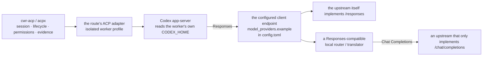

# The ACP channel and the provider-protocol boundary

English | [中文](acp-provider-protocols.md)

This page explains one thing that is easy to conflate: an ACP route or a listed model
**initializing** does not mean **real inference** will succeed. The first belongs to
the session and transport layer; the second belongs to the provider's HTTP protocol,
authentication, and network layer. The page describes the boundary only. It does not
define Worker Routing's core policy and does not choose a route, provider, model, or
fallback policy for the operator.

Every provider/model name, route name, port, path, and credential below is a synthetic
placeholder; real values belong in operator configuration outside Git. The repository
neither reads nor endorses them. Field definitions follow the
[custom native model picker guide](native-model-picker.en.md) and the installed Codex
version.

## The common `codex-acp`-style topology

Some ACP adapters are their own client, independent of Codex. Others are an "ACP
facade plus embedded Codex" wrapper (a common implementation looks like
`codex-acp`). That is **one** example, not a definition of ACP:



What matters in that picture:

- cwr-acp/acpx carry a complete responsibility, its lifecycle, permission responses,
  and execution evidence in and out. They do **not** translate provider HTTP wire
  formats.
- The adapter and the isolated worker profile decide what client/runtime actually runs
  and how it reaches a provider. The same upstream paired with a Chat
  Completions-only client and with a Codex app-server are two different reachability
  situations.
- Codex app-server reads the **worker's own** `CODEX_HOME`, not the main session's
  home. The main session's provider configuration does not follow the work order.
- `codex-acp` is only an example. Another adapter may embed a completely different
  model client, never read `config.toml`, and never use Responses. Do not treat this
  topology as the specification for every adapter.

## What each layer owns

| Layer | Owns | Does not own / cannot prove |
| --- | --- | --- |
| Model catalog / picker visibility | How Codex lists and describes a model to the user | A key, an endpoint, a real request, or the real provider identity |
| Adapter-advertised model | The model list the adapter reports over ACP | That the upstream accepts that model, or that the upstream is the provider it claims |
| ACP session success | Handshake, session create/resume, lifecycle, and permission flow | That any real inference happened |
| Responses-compatible client endpoint | The client sends Responses wire-format requests and parses replies | That the upstream itself implements Responses; a translator may be in between |
| Protocol translation | A proxy/router converting Responses to Chat Completions and back | That upstream auth, quota, or network access works |
| Upstream auth / entitlement / network | That the key, plan, region, and network really allow this call | Correct engineering work or a working tool loop |
| Real inference | Provider-side evidence tying the turn to a non-fixture upstream response | Independent provider/model identity, correct output, file edits, or tool-protocol compliance |
| Real tool / edit loop | That the model can reliably call tools and write results during a task | Coordinator acceptance |
| Coordinator acceptance | The main agent inspecting the diff, key invariants, and test evidence | Uninspected provider identity, account, and transport claims; it does not independently establish them |

These layers can hold independently. A passing layer neither implies nor is implied by
its neighbors.

## Synthetic `config.toml` example: Responses via a local router

Suppose the operator runs a local router that turns Responses into the upstream's
protocol. The worker's `CODEX_HOME` points at an isolated worker home whose
`config.toml` looks like this:

```toml
# Synthetic example; paths, ports, provider/model names, and key names are all
# operator-owned configuration outside Git.
# env_key is optional client-to-router authentication: omit the whole line when the
# local endpoint needs no client auth. It is not an upstream provider credential.
model = "example/model-id"
model_provider = "example"

[model_providers.example]
name = "Example synthetic Responses router"
base_url = "http://127.0.0.1:8080/v1"
env_key = "EXAMPLE_API_KEY"
wire_api = "responses"
```

Boundaries around that snippet:

- `base_url` here must be a **Responses-compatible client endpoint**; Codex currently
  only accepts `wire_api = "responses"`. A service that speaks only
  `/chat/completions` does not satisfy this layer even if it calls itself
  OpenAI-compatible.
- `env_key` is only a variable name, and it is **optional client-to-router
  authentication**, not an upstream provider credential. Omit the whole line when the
  local endpoint needs no client auth. Upstream provider secrets should stay in the
  router/forwarder's own operator-owned credential store when that architecture
  supports it, rather than entering the worker process. If the worker really must hold
  a client token, the operator prepares it and confirms the **worker process**
  actually inherits it; a key visible in the main session's shell does not prove the
  worker has one.
- That router's upstream mapping, ports, subscription priorities, and fallback policy
  are a separate operator configuration. They belong to neither this repository nor
  the ACP route schema. `127.0.0.1:8080` above is a placeholder.
- With a `codex-acp`-style adapter, this `config.toml` lives in the worker home, not in
  the main `$CODEX_HOME`. Other adapters may not read it at all.

## The Chat Completions-only upstream case

An upstream that implements only `/chat/completions` cannot serve as that endpoint
directly. Two workable routes:

1. Switch to a provider that implements `/responses` itself.
2. Put a translating proxy/router in the middle, so Codex sees Responses while the
   upstream speaks Chat Completions.

Option 2 moves the failure point into the translator: the Codex side may look stable
while the upstream still fails on the key, plan, model-id mapping, or network. A
translator must also translate function/tool calls, streaming events, and usage
correctly; otherwise the symptom is usually "it chats but does not edit reliably". The
translation layer is an independent operator-built component, outside the
responsibility of Worker Routing and cwr-acp.

## Verification ladder

Run the smallest checks in order; each step confirms only its own layer:

| Step | Observed | Proves only |
| --- | --- | --- |
| 1 | The model appears in the picker | Catalog/UI wiring |
| 2 | The adapter reports the model in a list | The adapter's claim, not upstream identity |
| 3 | An ACP session is created and one handshake completes | The session/transport/permission path works |
| 4 | A minimal Responses request reaches the endpoint and returns a valid Responses-shaped reply | The endpoint both accepts the request and satisfies the Responses wire contract |
| 5 | The adapter's client completes one round trip to the configured endpoint | That adapter client -> configured endpoint round trip works; it does not prove a real upstream call happened |
| 6 | Provider-side request/log/account evidence ties this turn to a non-fixture upstream response | Only now is there a basis to call it real inference; this still does not prove independent provider/model identity or output quality |
| 7 | The upstream output is plausible for the task | The response is usable; it does not prove editing or tool-protocol compliance |
| 8 | One small real edit or tool call lands on disk | The tool/edit loop works |
| 9 | The main agent inspects the diff and test evidence | Coordinator acceptance passed |

If step 3 passes while steps 5 and 6 fail, suspect protocol, endpoint, auth,
entitlement, or network before suspecting ACP itself. An ACP `run` receipt only marks
the end of one turn on that route; it does not even show the request left the
configured endpoint.

## Troubleshooting

| Symptom | Check first |
| --- | --- |
| ACP session succeeds but any execution errors out | The adapter client's endpoint, `wire_api`, key name, and upstream protocol |
| Errors mention `/responses` is unrecognized | The upstream only has Chat Completions; add a translator or change endpoints |
| The model is in the picker but not in the worker | The worker's own `CODEX_HOME`/`config.toml` and its catalog |
| The adapter lists a different model than expected | Where the adapter's model list comes from; it does not prove upstream identity |
| `401` or missing key | Which hop is authenticating: whether the worker inherited the variable named by `env_key`, and whether the router's own provider secret is in place |
| `404` or unknown model | Model-id mapping; whether the translator forwards the slug upstream |
| Chat works but editing or tools are unreliable | Translator function/tool and streaming translation, plus catalog capability claims |
| Everything looks right but output seems synthetic | Upstream entitlement/quota, and whether a cache or placeholder answered |

## Related documents

- [Optional ACP execution channel](acp-integration.md): route schema, commands, and
  security boundaries.
- [Custom native model picker](native-model-picker.en.md): full provider and catalog
  setup.
- [From zero to a first successful delegated task](first-delegated-task.en.md): locate
  the failing layer first.
- [Use the Command Code Provider API through Codex Router](commandcode-via-codex-router.en.md):
  a followable example of a Chat Completions-only upstream behind a local router, plus
  troubleshooting.
