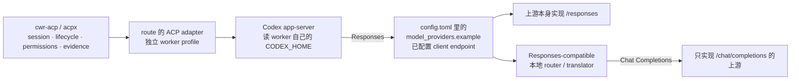

# ACP 通道与 provider 协议边界

[English](acp-provider-protocols.en.md) | 中文

这页解释一件经常被混为一谈的事：一条 ACP route 或一个已列出的 model **能初始化**，
不等于 **真实推理** 会成功。前者属于 session/传输层，后者属于 provider 的 HTTP 协议、
认证和网络层。文档只描述边界，不定义 Worker Routing 的核心策略，也不替 operator
选择 route、provider、model 或 fallback。

所有 provider/model 名、route 名、端口、路径与凭据在本文中都是合成占位；真实值留在
Git 外的 operator 配置。仓库不读取它们，也不为它们背书。协议字段以
[自定义 native model picker](native-model-picker.md) 与本机当前 Codex 版本为准。

## 最常见的 `codex-acp` 式拓扑

有的 ACP adapter 自己就是 Codex 之外的客户端；有的则是“ACP 外观 + 内嵌 Codex”的
包装器（常见实现形如 `codex-acp`）。后者只是**一种**例子，不是 ACP 的普遍定义：



读图要点：

- cwr-acp/acpx 只把一整块责任、生命周期、权限应答和执行证据搬进搬出；它们**不做**
  provider HTTP wire format 的转换。
- adapter 与隔离 worker profile 决定“实际跑什么客户端/运行时，以及它怎样到达 provider”。
  同一个上游配上一个只会 Chat Completions 的客户端，和配上一个 Codex app-server，
  是完全不同的可达性。
- Codex app-server 读的是 **worker 自己的** `CODEX_HOME`，不是主会话的 home。主会话
  的 provider 配置不会自动跟着走。
- `codex-acp` 只是举例；另一家 adapter 可能内置完全不同的模型客户端，不读
  `config.toml`，也不使用 Responses。不要把本文的拓扑当成所有 adapter 的规格。

## 各层负责什么

| 层 | 负责 | 不负责 / 不能证明 |
| --- | --- | --- |
| model catalog / picker 可见性 | Codex 如何向使用者列出与描述一个 model | key、endpoint、真实请求或真实 provider 身份 |
| adapter advertised model | adapter 向 ACP 报告它认为可用的 model 列表 | 该 model 真能被上游接受，或上游就是它声称的那个 provider |
| ACP session 成功 | 握手、session 建立/恢复、生命周期与权限流程可用 | 任何一次真实推理已发生 |
| Responses-compatible client endpoint | 客户端按 Responses wire format 发出请求并得到解析 | 上游自己实现 Responses；可能是中间 translator |
| 协议转换 | 一个 proxy/router 把 Responses 翻成 Chat Completions 再转回 | 上游的认证、配额或网络一定可用 |
| 上游 auth / entitlement / 网络 | key、套餐、地区与网络确实允许这次调用 | 工程内容正确或工具能跑 |
| 真实推理 | provider 侧证据把该 turn 绑定到非夹具的上游响应 | 独立 provider/model 身份、输出正确、会编辑文件或遵守工具协议 |
| 真实 tool / edit loop | 模型能在任务里可靠调用工具并落盘 | 主 agent 已验收 |
| coordinator 验收 | 主 agent 检查 diff、关键不变量与测试证据 | 未经单独检查的 provider 身份、账号与传输声明 |

这些层可以独立成立。任何一层“看起来通过”都不能上推或下推到相邻层。

## 合成 `config.toml` 示例：经本地 router 使用 Responses

假设 operator 在本机跑了一个会把 Responses 转成上游协议的 router。worker 的
`CODEX_HOME` 指向隔离 worker home，其 `config.toml` 形如：

```toml
# 合成示例；路径、端口、provider/model 名与 key 名都属于 operator 的 Git 外配置。
# env_key 是可选的 client → router 认证：本地 endpoint 不需要 client auth 时可整行省略，
# 它不是上游 provider 凭据。
model = "example/model-id"
model_provider = "example"

[model_providers.example]
name = "Example synthetic Responses router"
base_url = "http://127.0.0.1:8080/v1"
env_key = "EXAMPLE_API_KEY"
wire_api = "responses"
```

边界说明：

- 这里的 `base_url` 必须是 **Responses-compatible client endpoint**；Codex 当前只接受
  `wire_api = "responses"`。一个只讲 `/chat/completions` 的服务即使自称
  OpenAI-compatible，也不满足这层。
- `env_key` 只是变量名，而且是**可选的 client → router 认证**，不是上游 provider
  凭据。本地 endpoint 不需要 client auth 时可以整行省略。上游 provider secret 应在该
  架构支持时留在 router/forwarder 自己的 operator-owned credential store，而不是进入
  worker 进程；如果确实要让 worker 持有客户端 token，就由 operator 准备并确认
  **worker 进程** 真的继承到它，主会话 shell 里有 key 不证明 worker 有。
- 这个 router 的 upstream 映射、端口、套餐优先级与 fallback 是另一份 operator 配置，
  不属于本仓库，也不属于 ACP route schema。示例里的 `127.0.0.1:8080` 只是占位。
- 如果使用 `codex-acp` 式 adapter，这份 `config.toml` 位于 worker home，不是主会话
  `$CODEX_HOME`。其它 adapter 可能完全不读它。

## Chat Completions-only 上游

只实现 `/chat/completions` 的上游不能直接充当上面的 endpoint。两条可行路线：

1. 换一个上游本身实现 `/responses` 的 provider；
2. 在中间放一层做协议转换的 proxy/router，让它对 Codex 呈现 Responses，对上游说
   Chat Completions。

第 2 条路线把失败点挪到了 translator：Codex 侧可能稳定，但上游仍可能因 key、套餐、
model id 映射或网络失败。translator 还必须正确翻译工具/函数调用、流式事件与 usage，
否则现象往往是“能对话但不会可靠编辑”。翻译层是 operator 自建的独立组件，不在
Worker Routing 或 cwr-acp 的职责范围内。

## 验证阶梯

按顺序做最小验证，每步只确认自己那一层：

| 步骤 | 观察到 | 只证明 |
| --- | --- | --- |
| 1 | picker 里出现该 model | catalog/UI 接通 |
| 2 | adapter 报告该 model 在列表里 | adapter 的声明，不是上游身份 |
| 3 | ACP session 建立并完成一轮握手 | session/传输/权限路径可用 |
| 4 | 对 endpoint 发一个最小 Responses 请求，并拿到 Responses 形状的有效回复 | endpoint 不仅接受请求，还满足 Responses wire contract |
| 5 | adapter 客户端对已配置 endpoint 完成一次往返 | 该 adapter client → 已配置 endpoint 的往返可用；不证明发生过真实上游调用 |
| 6 | provider 侧 request/log/account 证据把这次 turn 绑定到非夹具的上游响应 | 这才能称真实推理已发生；仍不证明独立 provider/model 身份或输出质量 |
| 7 | 上游输出在内容上合理 | 该次响应可利用；不证明会编辑文件或遵守工具协议 |
| 8 | 一次小的真实编辑/工具调用落盘 | tool/edit loop 可用 |
| 9 | 主 agent 检查 diff 与测试证据 | coordinator 验收通过 |

如果第 3 步通过而第 5、6 步失败，优先怀疑协议、endpoint、认证、entitlement 或网络，
而不是 ACP 本身。ACP `run` 返回 receipt 只意味着该 route 的一次 turn 结束；它甚至不
说明请求离开了已配置 endpoint。

## 排错表

| 现象 | 先查 |
| --- | --- |
| ACP session 成功，但一执行就报错 | adapter 客户端用的 endpoint、`wire_api`、key 名与上游协议 |
| 错误信息提到 `/responses` 不被识别 | 上游只有 Chat Completions；加 translator 或换 endpoint |
| picker 里有 model，worker 里却没有 | worker 自己的 `CODEX_HOME`/`config.toml` 与 catalog 是否配置 |
| adapter 列出的 model 与预期不符 | adapter 的 model 列表来源；它不证明上游身份 |
| `401` / missing key | 先分清哪一段在认证：worker 是否继承了 `env_key` 指向的 client 变量，以及 router 自己的 provider secret 是否就位 |
| `404` / unknown model | model id 映射；translator 是否把 slug 透传给上游 |
| 能对话但编辑/工具不可靠 | translator 的函数/工具与流式事件翻译，以及 catalog 能力声明 |
| 一切看起来对但输出不像真实模型 | 上游 entitlement/配额、是否命中缓存或占位响应 |

## 相关文档

- [可选 ACP 执行通道](acp-integration.md)：route schema、命令与安全边界。
- [自定义 native model picker](native-model-picker.md)：provider 与 catalog 的完整配置。
- [从零到第一次成功派工](first-delegated-task.md)：先定位失败在哪一层。
