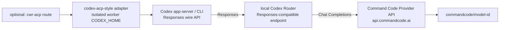

# Use the Command Code Provider API through Codex Router

English | [中文](commandcode-via-codex-router.md)

This is a concrete, followable how-to: connect Command Code's official Provider API to
Codex through the public Codex Router project, ending with a verifiable and reversible
machine-local bridge to a **remote** provider. You can then optionally expose the same
routed model to a `codex-acp`-style Worker Routing route with an isolated worker
profile.

Nature of this page: **optional reference material, not a Worker Routing core
contract.** Command Code's endpoints, product names, and the dated example model are
**real, dated upstream facts**; only local route names, paths, ports, generated
capability strings, and credential values are synthetic placeholders, with real values
in operator configuration outside Git. The repository neither reads nor endorses them.

Upstream facts checked on **2026-09-17**. Command Code, Codex Router, and Codex may all
change afterward, so recheck the official pages before you run anything. Field
definitions follow the
[custom native model picker guide](native-model-picker.en.md) and the installed Codex
version.

## What this page covers

- Exact commands to connect the Command Code Provider API to Codex.
- The protocol bridge: Codex custom providers speak Responses, while the Command Code
  Provider API offers Chat Completions and Messages, so a translation layer is needed
  in between.
- A per-layer verification ladder proving separately: entitlement/key, router health and
  catalog, one direct Codex inference, optional ACP handshake and ACP inference, and
  tool/write behavior.
- Optional: reuse the router already running on the machine for an ACP worker route with
  an isolated worker profile.
- How to undo the setup, and how to diagnose the common "model is listed but inference
  fails" cases.

Out of scope: choosing a provider/model or fallback for you, or proving real provider
identity. Worker Routing does not automatically install the ACP adapter; the optional,
operator-owned install is shown below. The ACP channel only carries sessions, lifecycle,
permissions, and evidence; it does not translate wire formats. See
[the ACP channel and provider-protocol boundary](acp-provider-protocols.en.md) for the
full layering.

## Architecture



Codex always sends Responses requests; the local Codex Router translates them to and
from Command Code's Chat Completions. An optional `cwr-acp` route sits at the front; it
only carries a complete responsibility and its evidence in and out, while the adapter
and worker profile decide the client that actually reaches the provider.

**Data-flow warning:** only the Codex-to-local-Router hop is localhost. Prompts,
attachments, and tool context sent for inference continue to Command Code and then to its
selected upstream. A local bridge is **not** a local-model or zero-egress guarantee;
data handling and privacy follow the official page
<https://commandcode.ai/docs/provider> and what it links to, and this page promises no
additional privacy properties.

## Prerequisites

- A working Codex installation.
- A Command Code account whose current plan includes Provider API access (see below).
- A macOS, Linux, or Windows machine able to run a local router process.
- Optional: an already-installed `codex-acp`-style adapter and this project's optional
  `integrations/acpx`, only if you want an ACP route.

## Upstream facts (checked 2026-09-17)

Command Code Provider API documentation: <https://commandcode.ai/docs/provider>

| Method | Path |
| --- | --- |
| `POST` | `https://api.commandcode.ai/provider/v1/chat/completions` |
| `POST` | `https://api.commandcode.ai/provider/v1/messages` |
| `GET` | `https://api.commandcode.ai/provider/v1/models` |

- **Plan entitlement:** as of 2026-09-17, every current plan except Go includes Provider
  API access. This is a dated upstream fact; recheck
  <https://commandcode.ai/docs/provider> before you run anything.
- **Protocol shape:** the Provider API offers Chat Completions and Messages, not
  Responses. Codex custom providers currently accept only `wire_api = "responses"`, so
  a Responses-compatible bridge is required between the two.
- **Authentication:** the official page explicitly documents
  `Authorization: Bearer <CMD_API_KEY>`.

Codex-side fields follow OpenAI's
[Advanced Configuration](https://developers.openai.com/codex/config-advanced/) and
[Configuration Reference](https://developers.openai.com/codex/config-reference/).

## Why Codex Router is involved

Codex custom providers currently send requests in the Responses wire format
(`wire_api = "responses"`), while the Command Code Provider API offers Chat Completions
and Messages. A component is needed to translate Responses to the upstream protocol and
back. That component here is the public **Codex Router** project:
<https://github.com/duolahypercho/codex-router>.

It presents a Responses-compatible endpoint to Codex **locally** and translates/forwards
to upstream Chat Completions (and other supported protocols). Beyond protocol
translation, that project owns additional compatibility handling, credential, catalog,
and forwarding behavior.

Do not treat bare LiteLLM YAML as a turnkey equivalent. LiteLLM
(<https://docs.litellm.ai/>) is a general forwarding/routing layer and is best treated
here as implementation context: the compatibility, credential, catalog, and forwarding
behavior a Codex coding-agent tool/reasoning loop needs is what Codex Router provides.
Conflating the two usually shows up as "it chats but does not edit reliably".

## Install Codex Router

Primary route (macOS/Linux, taken from the public README):

```sh
curl -fsSL https://raw.githubusercontent.com/duolahypercho/codex-router/main/install.sh \
  | sh -s -- --target codex --guided --with-tray
```

Homebrew:

```sh
brew tap duolahypercho/codex-router https://github.com/duolahypercho/codex-router
brew install codex-router
codex-router setup --guided
```

Windows PowerShell:

```powershell
$installer = Join-Path $env:TEMP "codex-router-install.ps1"
Invoke-WebRequest https://raw.githubusercontent.com/duolahypercho/codex-router/main/install.ps1 -OutFile $installer
powershell.exe -NoProfile -ExecutionPolicy Bypass -File $installer -Target codex -Guided -WithTray
```

These commands were checked on **2026-09-17**; upstream package channels and flags can
change, so recheck <https://github.com/duolahypercho/codex-router> before running them.

- **Homebrew is CLI/router-only** (the `codex-router` command); it does not include the
  tray/Control Center.
- The recommended installer (`install.sh` / `install.ps1`, with `--with-tray` /
  `-WithTray`) can include the tray/Control Center experience.

After installation:

- A **packaged install** uses one `codex-router` command, e.g. `codex-router status`;
- A **source checkout** uses the equivalent `./bin/model-router codex <command>`.

## Configure the Command Code provider

One-time setup for a packaged install:

```sh
codex-router provider-key commandcode set
codex-router providers enable commandcode
codex-router doctor
codex-router status
```

The first line enters the Provider API key locally and hidden. **Never paste a real key
into docs, chat, command history, Git, or a route config**; leave it in the router's own
local credential store. Then use `doctor` and `status` to confirm the router is healthy
and the Command Code provider is enabled.

## Make Codex see the models

The router merges a model catalog and exposes a local endpoint. The Codex side is still a
standard custom-provider configuration (full fields in the
[custom native model picker guide](native-model-picker.en.md)):

```toml
# Synthetic example; port and capability are explanatory placeholders whose real values
# come from the local router. The model id is a real dated upstream example, not a
# permanent default guarantee.
model = "commandcode/deepseek-v4.1-flash"
model_provider = "codex-router"

[model_providers.codex-router]
name = "Codex Router (local)"
base_url = "http://127.0.0.1:<router-port>/_codex-router/<generated-capability>/v1"
wire_api = "responses"
```

Points to note:

- `commandcode/deepseek-v4.1-flash` is one current example as of 2026-09-17, **not a
  permanent default guarantee**; defer to the catalog the router merges and what
  Command Code `GET /provider/v1/models` actually returns.
- `wire_api = "responses"` stays on the **Codex-facing side**; this is a Responses client
  endpoint even though it ultimately reaches Chat Completions.
- **Copy** the `[model_providers.codex-router]` block and catalog path the router wrote
  into your own Codex home; the `base_url` above is only an explanatory placeholder. The
  `/_codex-router/<generated-capability>/` segment inside `base_url`, together with host
  and port, forms a local **capability URL**: credential-like local secret material that
  you must not publish, commit, or screenshot.
- **If the capability did leak:** do not delete state files by hand. Use the router's own
  rotation command: `codex-router caller-key rotate` for a packaged/Homebrew install, or
  `./bin/model-router codex caller-key rotate` for a source checkout. After rotation,
  fully quit and reopen Codex or restart adapter sessions so they pick up the new
  endpoint.

## Verification ladder

Run the smallest checks in order; each step proves only its own layer. **A model
appearing in the picker proves no inference at all.**

| Step | What to do | Proves only |
| --- | --- | --- |
| 1 | Call `GET https://api.commandcode.ai/provider/v1/models` with your Provider API key | Command Code plan entitlement and key are valid |
| 2 | Run `codex-router doctor` and `codex-router status`, and confirm the target model is in the router catalog | Router health and catalog wiring |
| 3 | One **direct** Codex inference, e.g. `codex exec -m commandcode/deepseek-v4.1-flash 'Reply with exactly: OK'` | The Codex -> router -> Command Code Responses round trip works |
| 4 | Optional: create the ACP route and complete one handshake | Session/transport/permission path works |
| 5 | Optional: run one minimal inference on that route | That ACP worker's client -> configured endpoint round trip works |
| 6 | One small real edit or tool call lands on disk | The tool/edit loop works |

For step 1, first set `CMD_API_KEY` in your own credential manager or environment, then
inject it, e.g.
`curl -sS -H "Authorization: Bearer ${CMD_API_KEY:?set it locally}" https://api.commandcode.ai/provider/v1/models`.
Keep the literal key only in the local environment or credential manager; do not let it
enter command history, docs, or Git. This page does not provide a cross-platform
secret-entry command.

**Steps 3 and 5 consume real Command Code usage/credits** and must be run only when you
explicitly choose to. A valid reply is what proves the layer; "it is listed" is not.

## Optional: hand the same model to an ACP worker route

This section concretizes the `codex-acp`-style topology above. Isolation points:

- cwr-acp sets the adapter process's `CODEX_HOME` to `<workerHome>/.codex`; **the main
  Codex configuration is not inherited by the worker**.
- Reuse the router **already running** on this machine; do not start a second router on
  the same default ports merely to configure the worker.
- In the worker's private `<workerHome>/.codex/config.toml`: set `model` to the routed
  model, `model_provider = "codex-router"`, point `model_catalog_json` at the **existing
  router's merged catalog**, and copy over the router-managed
  `[model_providers.codex-router]` block and catalog path from the main Codex config
  **verbatim**. Use placeholders only; the full generated local capability URL is
  credential-like local secret material that must not be published.
  `wire_api = "responses"` stays on the Codex-facing side.

The adapter is the public [`agentclientprotocol/codex-acp`](https://github.com/agentclientprotocol/codex-acp)
project; installing it is an operator-owned, optional step:

```sh
npm install -g @agentclientprotocol/codex-acp
codex-acp --version
```

A standalone global `codex-acp` **is itself the stdio ACP server**; do not append an
invented `acp` subcommand. cwr-acp needs the resolved absolute executable path: use
`command -v codex-acp` on POSIX and the platform equivalent on Windows.

Worker `config.toml` (synthetic placeholders):

```toml
# Synthetic example; paths, port, capability, and catalog path are explanatory
# placeholders.
model = "commandcode/deepseek-v4.1-flash"
model_provider = "codex-router"
model_catalog_json = "/absolute/path/to/codex-home/codex-router/merged-models.json"

[model_providers.codex-router]
name = "Codex Router (local)"
base_url = "http://127.0.0.1:<router-port>/_codex-router/<generated-capability>/v1"
wire_api = "responses"
```

Route fragment (a synthetic `cwr.acp.config/1` placeholder; schema in
[`routes.example.json`](../integrations/acpx/examples/routes.example.json)):

```json
{
  "schema": "cwr.acp.config/1",
  "stateDir": "/absolute/private/cwr-acp-state",
  "routes": {
    "commandcode-worker": {
      "enabled": true,
      "argv": ["/absolute/path/to/codex-acp"],
      "workerHome": "/absolute/private/worker-homes/commandcode-worker",
      "workspaces": ["/absolute/private/worktrees/example-repo"],
      "passEnv": [],
      "contextRevision": "commandcode-router-worker-v1",
      "maxPermissions": "read",
      "sessionOptions": { "model": "commandcode/deepseek-v4.1-flash" },
      "timeoutMs": 900000
    }
  }
}
```

Field notes:

- `argv` is the absolute path to the **already-installed** `codex-acp` executable,
  **with no extra subcommand**: a global `codex-acp` is itself the stdio ACP server, so do
  not add an `acp` argument. cwr-acp starts it with `workerHome` as its home. Installing
  the adapter is an operator-owned, optional step: **Worker Routing does not install the
  adapter**, and real adapter behavior must be verified separately.
- `passEnv: []` passes no extra environment variables by default. Keep it empty when the
  router needs no client auth locally; if the worker really must hold a client token,
  list only the needed variable names and confirm the **worker process** actually
  inherits it (a variable in the main session's shell is not proof).
- `contextRevision` labels the reviewed engineering profile; update it when the
  configuration, tools, or injection boundary change.
- `maxPermissions` selects cwr-acp's response policy for ACP permission requests
  (`read`/`full`); it is **not a file-access sandbox**.
- `sessionOptions.model` must match the adapter's currently advertised model before a
  work order is sent.
- The `cwd` must exactly match one entry in `workspaces`; keep the route config, worker
  home, and adapter outside Git.

Route schema, commands, and security boundaries are in the
[optional ACP execution channel](acp-integration.md).

## Troubleshooting

| Symptom | Check first |
| --- | --- |
| Plan lacks Provider API access (Go especially) | Upstream entitlement: whether `GET /provider/v1/models` returns 200 and whether the plan includes Provider API (see the official page) |
| `401` or missing key | First check the Command Code provider key stored in the Router, and whether the worker copied the **current** router-written endpoint/capability block (this example does not use `env_key`) |
| Model listed but inference fails | The protocol bridge: Codex speaks Responses, Command Code speaks Chat Completions; confirm Codex Router is in between and the model-id mapping is right |
| Worker cannot see the model | The worker's own `<workerHome>/.codex/config.toml` (`model`/`model_provider`/`model_catalog_json`); main-session config is not inherited |
| Router is not running | `codex-router status` and `codex-router doctor`; whether the port is taken; do not start a second router just to configure the worker |
| Stale Codex picker | `model_catalog_json` is read at startup; fully quit and reopen Codex instead of only editing the file |
| Wrong protocol endpoint | `base_url` must be a Responses-compatible endpoint; `/provider/v1/chat/completions` cannot serve as the Codex endpoint directly |
| Capability URL exposure | If the capability segment inside `base_url` reached Git, a screenshot, or chat, treat it as a credential leak and rotate with `codex-router caller-key rotate` (or `./bin/model-router codex caller-key rotate` from a source checkout); do not delete state files by hand |
| Chat works but edits are unreliable | Translator function/tool and streaming translation, plus whether catalog capability claims match reality |

## Rollback

- **Codex Router (packaged / Homebrew):** `codex-router uninstall`. Run
  `brew uninstall codex-router` only when the formula itself should also be removed;
  `codex-router uninstall` is enough to undo the router state this flow introduced.
- **Source checkout / managed one-command install:** run
  `./bin/model-router codex uninstall` from the checkout.
- **Windows:** run `./codex-router.ps1 uninstall` (equivalently
  `./model-router.ps1 codex uninstall`) from the checkout. This too is a dated upstream
  fact; recheck <https://github.com/duolahypercho/codex-router> before running it.
- **Codex side:** remove or restore `model`, `model_provider`, `model_catalog_json`, and
  the corresponding `[model_providers.codex-router]` table in the user-level
  `config.toml`, then fully quit and reopen Codex. See the rollback section of the
  [custom native model picker guide](native-model-picker.en.md).
- **ACP route:** deleting that route from the route config (and cleaning up its private
  `stateDir`/`workerHome` as needed) is a **separate** action, unrelated to uninstalling
  the router. See the [optional ACP execution channel](acp-integration.md).
- Remove only the keys and routes this flow added; **do not delete user-owned
  configuration**.

## Related documents

- [Custom native model picker](native-model-picker.en.md): full provider and catalog
  setup.
- [The ACP channel and the provider-protocol boundary](acp-provider-protocols.en.md):
  why initializing is not inference.
- [Optional ACP execution channel](acp-integration.md): route schema, commands, and
  security boundaries.
- [From zero to a first successful delegated task](first-delegated-task.en.md): locate
  the failing layer first.
