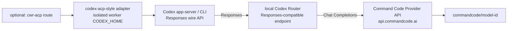

# 经 Codex Router 使用 Command Code Provider API

[English](commandcode-via-codex-router.en.md) | 中文

这页是一份可以直接照做的 how-to：把 Command Code 官方 Provider API 通过公开项目
Codex Router 接到 Codex，阅读者能据此得到一条可验证、可撤销、通往**远端** provider 的
本机桥接路径；之后可选地把同一个已路由 model 暴露给一个 `codex-acp` 式 Worker Routing
route，并使用隔离的 worker profile。

性质：**可选参考材料，不是 Worker Routing 的核心契约**。Command Code 的 endpoint、
产品名与带日期的示例 model 是**真实的、带日期的上游事实**；只有本地 route 名、路径、端口、
生成的 capability 串与凭据值才是合成占位，真实值留在 Git 外的 operator 配置里。仓库不读取
也不背书它们。

上游事实核对日期：**2026-09-17**。Command Code、Codex Router 与 Codex 都可能在之后变化，
执行前请重读官方页面。协议字段以
[自定义 native model picker](native-model-picker.md) 与本机当前 Codex 版本为准。

## 这页解决什么

- 用精确命令把 Command Code Provider API 接到 Codex；
- 说清协议桥：Codex 自定义 provider 说 Responses，Command Code Provider API 提供
  Chat Completions 与 Messages，中间需要一个翻译层；
- 给出逐层验证阶梯，证明 entitlement/key、router 健康与 catalog、一次真实推理、可选的
  ACP 握手与 ACP 推理、以及工具/写盘分别成立；
- 可选：把同一台机器上已经在跑的 router 复用给一个 ACP worker route，使用隔离 worker
  profile；
- 能撤销，并诊断最常见的“model 列出来了但推理失败”。

不负责：替你选择 provider/model 或 fallback、证明真实 provider 身份。Worker Routing 不会
自动安装 ACP adapter；可选的、operator 自有的安装步骤见下文。ACP 通道只搬 session、
生命周期、权限与证据，不翻译 wire format；分层的完整说明见
[ACP 通道与 provider 协议边界](acp-provider-protocols.md)。

## 架构



Codex 侧始终按 Responses 发请求；本地 Codex Router 把它翻成 Command Code 的
Chat Completions 并转发；可选的 `cwr-acp` route 位于最前面，它只把一整块责任和证据
搬进搬出，真正到达 provider 的客户端由 adapter 与 worker profile 决定。

**数据流提醒**：只有 Codex → 本机 Router 这一跳是 localhost。用于推理的 prompt、附件与
工具上下文会继续发往 Command Code，再经它到达所选的上游 provider。本机桥接**不是**本地
模型、也不是零出网保证；数据处理与隐私以官方页面
<https://commandcode.ai/docs/provider> 及其链接的说明为准，本页不额外承诺任何隐私性质。

## 前置条件

- 一个可用的 Codex 安装；
- 一个 Command Code 账号，且当前计划包含 Provider API 访问（见下）；
- 一台能运行本地 router 进程的 macOS、Linux 或 Windows 机器；
- 可选：已安装的 `codex-acp` 式 adapter，以及本项目可选的 `integrations/acpx`，仅在你
  要接 ACP route 时需要。

## 上游事实（核对于 2026-09-17）

Command Code Provider API 官方文档：<https://commandcode.ai/docs/provider>

| 方法 | 路径 |
| --- | --- |
| `POST` | `https://api.commandcode.ai/provider/v1/chat/completions` |
| `POST` | `https://api.commandcode.ai/provider/v1/messages` |
| `GET` | `https://api.commandcode.ai/provider/v1/models` |

- **计划 entitlement**：截至 2026-09-17，Go 计划之外的当前计划都包含 Provider API 访问。
  这是会变的上游事实；执行前请重读 <https://commandcode.ai/docs/provider> 确认自己的计划。
- **协议形状**：Provider API 提供的是 Chat Completions 与 Messages，不是 Responses。
  当前 Codex 自定义 provider 只接受 `wire_api = "responses"`，所以两者之间必须有一个
  Responses-compatible 的桥。
- **认证**：官方文档明确使用 `Authorization: Bearer <CMD_API_KEY>`。

Codex 侧字段以 OpenAI 官方的
[Advanced Configuration](https://developers.openai.com/codex/config-advanced/) 与
[Configuration Reference](https://developers.openai.com/codex/config-reference/) 为准。

## 为什么需要 Codex Router

Codex 自定义 provider 当前按 Responses wire format 发请求（`wire_api = "responses"`）；
Command Code Provider API 提供的是 Chat Completions 与 Messages。二者之间需要一个把
Responses 翻成上游协议、再把上游响应翻回 Responses 形状的组件。这里用的是公开项目
**Codex Router**：<https://github.com/duolahypercho/codex-router>。

它在**本机**暴露一个 Responses-compatible endpoint 给 Codex，并向
Chat Completions（以及其它受支持协议）的上游翻译与转发。除协议翻译外，这个项目自己
还负责额外的兼容处理、凭据、model catalog 与转发行为。

不要把裸 LiteLLM YAML 当成等价的一步到位方案。LiteLLM（<https://docs.litellm.ai/>）是
通用转发/路由层，在这里只适合作为实现上下文参考；Codex coding-agent 的 tool 与
reasoning loop 需要的兼容、凭据、catalog 与转发行为由 Codex Router 这类项目承担。
把两者混同，典型表现就是“能对话但不能可靠编辑”。

## 安装 Codex Router

主路线（macOS/Linux，取自公开 README）：

```sh
curl -fsSL https://raw.githubusercontent.com/duolahypercho/codex-router/main/install.sh \
  | sh -s -- --target codex --guided --with-tray
```

Homebrew：

```sh
brew tap duolahypercho/codex-router https://github.com/duolahypercho/codex-router
brew install codex-router
codex-router setup --guided
```

Windows PowerShell：

```powershell
$installer = Join-Path $env:TEMP "codex-router-install.ps1"
Invoke-WebRequest https://raw.githubusercontent.com/duolahypercho/codex-router/main/install.ps1 -OutFile $installer
powershell.exe -NoProfile -ExecutionPolicy Bypass -File $installer -Target codex -Guided -WithTray
```

以上命令核对于 **2026-09-17**；上游的包渠道与参数都可能变化，执行前请重读
<https://github.com/duolahypercho/codex-router>。

- **Homebrew 只安装 CLI/router**（`codex-router` 命令），不含托盘/Control Center。
- 推荐的 installer（`install.sh` / `install.ps1`，带 `--with-tray` / `-WithTray`）可以一并安装
  托盘/Control Center 体验。

安装后：

- **包安装**用一个 `codex-router` 命令，例如 `codex-router status`；
- **源码 checkout** 用等价形式 `./bin/model-router codex <command>`。

## 配置 Command Code provider

包安装下的一次性设置：

```sh
codex-router provider-key commandcode set
codex-router providers enable commandcode
codex-router doctor
codex-router status
```

第一行在本地、隐藏地录入 Provider API key。**不要把真实 key 贴进文档、聊天、命令历史、
Git 或 route config**；让它留在 router 自己的本地凭据存储里。之后用 `doctor` 与 `status`
确认 router 健康、Command Code provider 已启用。

## 让 Codex 看到这些 model

router 会合并出一份 model catalog，并在本机暴露 endpoint。Codex 侧仍是标准的自定义
provider 配置（完整字段见[自定义 native model picker](native-model-picker.md)）：

```toml
# 合成示例；端口与 capability 是解释性占位，真实值来自本机 router。
# model id 是带日期的真实上游示例，不是永久默认保证。
model = "commandcode/deepseek-v4.1-flash"
model_provider = "codex-router"

[model_providers.codex-router]
name = "Codex Router (local)"
base_url = "http://127.0.0.1:<router-port>/_codex-router/<generated-capability>/v1"
wire_api = "responses"
```

要点：

- `commandcode/deepseek-v4.1-flash` 是 2026-09-17 的一个当前示例，**不是永久默认保证**；
  以 router 合并出的 catalog 与 Command Code `GET /provider/v1/models` 实际返回为准。
- `wire_api = "responses"` 保持在 **Codex 面向的一侧**；这是一个 Responses client
  endpoint，即使它背后最终走 Chat Completions。
- **直接复制**你自己 Codex home 里 router 写好的 `[model_providers.codex-router]` 块与 catalog
  路径；上面的 `base_url` 只是解释性占位。`base_url` 中 `/_codex-router/<generated-capability>/`
  这一段连同主机与端口构成一个本地 **capability URL**：它等同于一个本地秘密，不要发布、
  不要进 Git、不要截图。
- **如果 capability 确实泄露了**：不要手工删除 state 文件，用 router 自带的轮换命令——
  包安装/Homebrew 用 `codex-router caller-key rotate`，源码 checkout 用
  `./bin/model-router codex caller-key rotate`。轮换后要**完全退出并重开 Codex**，或重启
  adapter session，让它们重新读取新的 endpoint。

## 验证阶梯

按顺序做最小验证，每步只证明自己那一层。**model 出现在 picker 里不构成任何推理证明。**

| 步骤 | 做什么 | 只证明 |
| --- | --- | --- |
| 1 | 用 Provider API key 调 `GET https://api.commandcode.ai/provider/v1/models` | Command Code 计划 entitlement 与 key 有效 |
| 2 | `codex-router doctor`、`codex-router status`，并确认 router catalog 里有目标 model | router 健康、catalog 接通 |
| 3 | 一次**直接** Codex 推理，例如 `codex exec -m commandcode/deepseek-v4.1-flash 'Reply with exactly: OK'` | Codex → router → Command Code 的 Responses 往返成立 |
| 4 | 可选：建立 ACP route 并完成一次握手 | session/传输/权限路径可用 |
| 5 | 可选：对该 route 跑一次最小推理 | 该 ACP worker 的客户端 → 已配置 endpoint 往返可用 |
| 6 | 一次小的真实编辑/工具调用落盘 | tool/edit loop 可用 |

第 1 步先用你自己的凭据管理器或环境把 `CMD_API_KEY` 设好，再用它注入凭据，例如
`curl -sS -H "Authorization: Bearer ${CMD_API_KEY:?set it locally}" https://api.commandcode.ai/provider/v1/models`。
让字面 key 只留在本地环境或凭据管理器，不要进入命令历史、文档或 Git；本页不提供跨平台
写秘密的具体命令。

**第 3 步与第 5 步会真实消耗 Command Code 的 usage/credits**，必须由你显式选择后才跑。
拿到有效回复才证明这一层通；仅“列出来了”不算。

## 可选：把同一个 model 交给 ACP worker route

这一段把上面的路径具体化为 `codex-acp` 式拓扑。隔离要点：

- cwr-acp 把 adapter 进程的 `CODEX_HOME` 设为 `<workerHome>/.codex`；**主 Codex 的配置
  不会被 worker 继承**。
- 复用**已经在本机运行**的那个 router；不要为了配置 worker 在同一组默认端口上再起第二个
  router。
- 在 worker 私有的 `<workerHome>/.codex/config.toml` 里：把 `model` 设为该路由 model，
  `model_provider = "codex-router"`，把 `model_catalog_json` 指向**现有 router 的合并
  catalog**，并把主 Codex 配置里 router 写好的 `[model_providers.codex-router]` 块与
  catalog 路径**原样复制**过来。只用占位；完整的本地 capability URL 是等同凭据的本地秘密，
  不要发布。`wire_api = "responses"` 仍在 Codex 面向的一侧。

adapter 使用公开项目 [`agentclientprotocol/codex-acp`](https://github.com/agentclientprotocol/codex-acp)；
安装是 operator 自有的可选步骤：

```sh
npm install -g @agentclientprotocol/codex-acp
codex-acp --version
```

独立的全局 `codex-acp` **本身就是 stdio ACP server**，不要再附加自造的 `acp` 子命令。cwr-acp
需要解析后的绝对可执行路径：POSIX 用 `command -v codex-acp` 取得，Windows 用平台上的对应方式。

worker 的 `config.toml`（合成占位）：

```toml
# 合成示例；路径、端口、capability 与 catalog 路径都是解释性占位。
model = "commandcode/deepseek-v4.1-flash"
model_provider = "codex-router"
model_catalog_json = "/absolute/path/to/codex-home/codex-router/merged-models.json"

[model_providers.codex-router]
name = "Codex Router (local)"
base_url = "http://127.0.0.1:<router-port>/_codex-router/<generated-capability>/v1"
wire_api = "responses"
```

route 片段（`cwr.acp.config/1` 的合成占位，schema 见
[`routes.example.json`](../integrations/acpx/examples/routes.example.json)）：

```json
{
  "schema": "cwr.acp.config/1",
  "stateDir": "/absolute/private/cwr-acp-state",
  "routes": {
    "commandcode-worker": {
      "enabled": true,
      "argv": ["/absolute/path/to/codex-acp"],
      "workerHome": "/absolute/private/worker-homes/commandcode-worker",
      "workspaces": ["/absolute/private/worktrees/example-repo"],
      "passEnv": [],
      "contextRevision": "commandcode-router-worker-v1",
      "maxPermissions": "read",
      "sessionOptions": { "model": "commandcode/deepseek-v4.1-flash" },
      "timeoutMs": 900000
    }
  }
}
```

字段说明：

- `argv` 是**已经安装**的 `codex-acp` 可执行文件的绝对路径，**不带任何额外子命令**：全局
  `codex-acp` 自己就是 stdio ACP server，不要再加 `acp` 之类的参数。cwr-acp 会以
  `workerHome` 为 home 启动它。adapter 安装是 operator 自有的可选步骤：
  **Worker Routing 不安装 adapter**，真实 adapter 行为必须自行验证。
- `passEnv: []` 表示默认不额外传入环境变量。若 router 在本机不需要 client auth，保持为空；
  确需让 worker 持有客户端 token 时，只列必要变量名，并确认 **worker 进程**真的继承到了它
  （主会话 shell 里有变量不算证明）。
- `contextRevision` 标识已审核的工程 profile；配置、工具或注入边界变化后要更新。
- `maxPermissions` 选择 cwr-acp 对 ACP permission request 的应答策略（`read`/`full`），
  **不是文件系统 sandbox**。
- `sessionOptions.model` 在开工前必须与 adapter 当前 advertised model 一致。
- `workspaces` 里的 `cwd` 必须精确匹配；route config、worker home 与 adapter 都留在 Git 外。

route schema、命令与安全边界见[可选 ACP 执行通道](acp-integration.md)。

## 排错

| 现象 | 先查 |
| --- | --- |
| 计划不含 Provider API（Go 计划尤其） | 上游 entitlement：`GET /provider/v1/models` 是否 200，以及计划是否含 Provider API（见官方页面） |
| `401` / missing key | 先查 Router 里保存的 Command Code provider key 是否就位，以及 worker 是否复制了**当前** router 写好的 endpoint/capability 块（本示例不使用 `env_key`） |
| model 列出来了但推理失败 | 协议桥：Codex 说 Responses、Command Code 说 Chat Completions；确认 Codex Router 在中间，且 model id 映射正确 |
| worker 看不到 model | worker 自己的 `<workerHome>/.codex/config.toml`（`model`/`model_provider`/`model_catalog_json`）；主会话配置不会继承 |
| router 没在跑 | `codex-router status` 与 `codex-router doctor`；端口是否被占用；不要为配 worker 再起第二个 router |
| Codex picker 陈旧 | `model_catalog_json` 在启动时读取；完全退出并重开 Codex，而不是只改文件 |
| 用错协议 endpoint | `base_url` 必须是 Responses-compatible endpoint；`/provider/v1/chat/completions` 不能直接当 Codex endpoint |
| capability URL 暴露 | 若 `base_url` 里的 capability 段进了 Git、截图或聊天，视为凭据泄露并用 `codex-router caller-key rotate`（或源码 checkout 的 `./bin/model-router codex caller-key rotate`）轮换；不要手工删除 state 文件 |
| 能对话但不能可靠编辑 | 翻译层的工具/函数与流式事件翻译，以及 catalog 能力声明是否与实际一致 |

## 撤销

- **Codex Router（包安装 / Homebrew）**：`codex-router uninstall`。只有在**公式本身**也要移除
  时，再 `brew uninstall codex-router`；撤销本流程引入的 router 状态用 `codex-router uninstall`
  就够。
- **源码 checkout / managed one-command 安装**：在 checkout 目录内运行
  `./bin/model-router codex uninstall`。
- **Windows**：在 checkout 目录内运行 `./codex-router.ps1 uninstall`（等价形式
  `./model-router.ps1 codex uninstall`）。这同样是带日期的上游事实；执行前请重读
  <https://github.com/duolahypercho/codex-router>。
- **Codex 侧**：从用户级 `config.toml` 删除或改回 `model`、`model_provider`、
  `model_catalog_json` 以及对应的 `[model_providers.codex-router]` table，然后完全退出并
  重开 Codex。步骤见[自定义 native model picker](native-model-picker.md)的撤销段。
- **ACP route**：从 route config 删除该 route（并按需清理对应的私有 `stateDir`/`workerHome`）
  是**另一件事**，与卸载 router 无关，见[可选 ACP 执行通道](acp-integration.md)。
- 只移除本流程新增的键与 route；**不要删除用户自有的配置**。卸载 router 与删除一条 route
  是两件独立的事。

## 相关文档

- [自定义 native model picker](native-model-picker.md)：provider 与 catalog 的完整配置。
- [ACP 通道与 provider 协议边界](acp-provider-protocols.md)：为什么能初始化不等于能推理。
- [可选 ACP 执行通道](acp-integration.md)：route schema、命令与安全边界。
- [从零到第一次成功派工](first-delegated-task.md)：先定位失败在哪一层。
