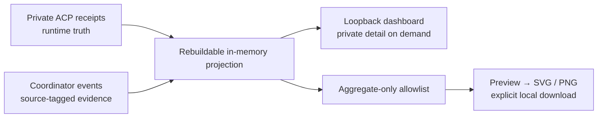

# Dispatch · 派工台

[English](dispatch.en.md) | 中文

平时照常派活，回执会自然留下协作轨迹。Dispatch 把已有 ACP 回执与主协调者
主动留下的复盘记录，投影成一张本地只读面板。它不接管调度，也不另建
任务数据库。原生 Codex worker 尚无接入的数据源，页面上的数字只覆盖 ACP。

## 打开

使用已设置好的 [ACP integration](acp-integration.md)，在 canonical checkout 中运行：

```sh
node integrations/acpx/src/cli.mjs dashboard --config /absolute/private/routes.json
```

打开命令打印的私人 loopback URL。默认使用随机可用端口；需要固定端口时加
`--port 4317`。可加 `--since 7d`、`--since 30d` 或 `--since 2026-01-01`；默认是
`all`。页面可以切换窗口、搜索责任与 route、筛选需要跟进的事项与早期记录、查看完整责任回放，
在「纸张与伙伴」里换配色，也可以切换中文和 English。

面板前台运行，不安装服务。点击「关闭面板」或在 CLI 按 Ctrl+C 会释放进程。
关闭最后一个页面后，心跳停止，服务约两分钟后自动退出；从未打开的链接保留五分钟。
浏览器休眠或长时间冻结也可能停止心跳，此时重新运行命令即可。面板出错不影响 ACP
派工和已有会话。

只看文字或接入自己的本地工具：

```sh
node integrations/acpx/src/cli.mjs stats --config /absolute/private/routes.json --since 7d
node integrations/acpx/src/cli.mjs stats --config /absolute/private/routes.json --since 7d --json
```

`stats --json` 是私有本地投影，包含 route、标题和 session 关联信息，**不适合直接公开**。
它不读取账号额度，不扫描 Codex rollout，不调用模型或 adapter。

## 首页与记录

默认 Home 是统计总览：累计责任、执行轮次与外部工作量，下方是覆盖整个窗口的时间柱形图、
可切换执行 / 主动复盘的状态环图、route 工作量分布和修正原因。
柱形可以切换「执行轮次 / 新派责任」，hover、键盘聚焦或触摸查看分段数字；新派责任仅按
窗口内创建时间计数，可能少于上方含旧 session 续做的责任总数。点 route 可进入对应记录。

## 主题：四套配色与同族动物

主题固定为四套，只有两个权威来源：[`themes.mjs`](../integrations/acpx/src/themes.mjs) 定义
id、名称与配色，[`mascots.mjs`](../integrations/acpx/src/mascots.mjs) 定义陪伴动物画法。
首页（含图表）与分享图共用同一份 `THEMES`/`getTheme`：

| id | 名称 | 配色 | 陪伴动物 |
| --- | --- | --- | --- |
| `sage` | 鼠尾草猫 / Sage cat（默认） | 鼠尾草粉 / Sage & blush | 折耳猫（Canon） |
| `rose` | 燕麦玫瑰兔 / Oat bunny | 燕麦玫瑰 / Oat & rose | 兔 |
| `mist` | 雾蓝奶油狗 / Mist puppy | 雾蓝奶油 / Mist & cream | 狗 |
| `lavender` | 薰衣草杏熊 / Lilac bear | 薰衣草杏 / Lilac & apricot | 熊 |

首页顶部的「纸张与伙伴」选择器把该主题的配色应用到整页面板与图表，并把该主题的陪伴动物
放到首页标签与分享图圆章；选择记在同 dashboard 地址的 `localStorage`，刷新后恢复；没有记住
或不可用的 id 一律回落到 `sage`。未知或非法的 theme id 只会回落，不会注入颜色或标记。

Canon 身份是「折耳猫 + 默认鼠尾草配色」这一组：折耳猫矢量保留在
[`brand.mjs`](../integrations/acpx/src/brand.mjs)，页首标识、favicon、分享图页首与独立 logo
下载在每套主题下都用它，`mascots.mjs` 只用它作为默认与回落，不复制也不改色。
换主题会改变纸张、图表、圆章底色与圆章里的陪伴动物。

执行视图覆盖所有责任；复盘视图只纳入明确记录的接受、接管、送验与返修，不显示
“记录覆盖率”，也不把普通完成列为待验收。有执行异常或明确提出的复查时，首页才显示
跟进入口；没有需要跟进的事项，就不显示这块。

旧记录没有标题时，以发起时间作描述，详情说明来源，不从工单正文猜测内容。
「记录」提供搜索、早期记录筛选与责任回放，可查看工单、各轮回执及有来源的证据。

## 默认不增加记账动作

照常 `run`、`continue`、`close`。责任、轮次、时长、完成 / 失败 / 取消和可归属 tokens
都从已有回执读取，不需要每次追加 `submitted` 或 `accepted`，不强制补齐历史。
运行完成只说明 runtime 完成，页面也不会把它冒充工程验收。

可以在原派工命令上带简短标题和类别，方便之后找回：

```sh
node integrations/acpx/src/cli.mjs run --config /absolute/private/routes.json \
  --route registered-worker --cwd /absolute/approved/worktree \
  --file /absolute/work-order.md --title '修复空输入处理' --category implementation
```

只有一次真正的返修值得留下原因时，在原续做命令上顺手带参数，无需另建 JSON：

```sh
node integrations/acpx/src/cli.mjs continue --config /absolute/private/routes.json \
  --session 22222222-2222-4222-8222-222222222222 --file /absolute/rework.md \
  --revision-reason validation_failed
```

这是可选捷径，不要求每次续做分类。记录失败会给出提示，但不会阻断原工作。
正常续做不计为修正；返修收到成功回执后不再留下未处理的返修事项。只有明确记录
`submitted`，才表示另有待复查的请求。普通关闭没有验收标记也是正常结束。

如果某项任务本来就需要保留主机验证或接管判断，可主动使用 `record`。
证据区分 `coordinator` 与 `worker`；worker 自述不自动升级为主机独立验证。
事件 schema、原因、修订与来源规则见 [Dispatch 数据契约](dispatch-data.md)。
不为统计调用额外模型，也不从旧输出猜测接受结论。

按需查看需要留意的事项，不是每次派工后的固定步骤：

```sh
node integrations/acpx/src/cli.mjs pending --config /absolute/private/routes.json
```

`pending` 只读本地数据，列出执行异常或明确提出、尚未处理的复查 / 返修。
普通完成、正常关闭、没有复盘标记的历史不会变成待办。
更新后的 `acp-worker` skill 遵守这一默认；source 不会自动更新已安装 plugin cache，
按[插件更新流程](installation.md#plugin)正常 reinstall，新主 session 才会加载新说明。

## 数字的边界

Adapter 通常报告 session 累计量。三轮回执分别是 100、180、250 tokens，累计工作量
是 250，不是 530。窗口内统计需要可归属的增量；缺少边界、累计量重置或未知数据时，
覆盖率与提示一起显示，不把未知填成零。各 route 的时长只描述各自实际任务，并带样本数，
不能在未匹配任务复杂度时当成模型性能排名。

这些数字既不是 billing 证明，也不是 Codex 节省额度。Dispatch 不安排重复 A/B 工作，
不估算「省了百分之几」，不为主机或 worker 打总分。记录可以帮助人判断协作质量，
但主机写下的归因仍然是当时的判断；回放中的工单与回执可供核查。

## 分享

点击「导出分享图」，先检查预览，再下载横版 **1600 × 900** 或竖版 **1080 × 1350**
的 SVG / PNG。导出窗口可独立选择中文版 / English 版，不受面板语言限制；
中文有对应的标题与布局。导出窗口每次打开时以面板当前配色为起点，并可在窗口内单独换一套，
只影响这张分享图，不改动面板配色；配色、语言与横竖版三个选择互相独立。下载文件名由主题、语言、
版式与日期组成（`worker-routing-THEME-LANGUAGE-FORMAT-DATE.ext`），因此四套配色 × 两种语言 ×
两种版式 × SVG/PNG = 32 种组合各自可辨。导出覆盖所选时间窗口的全部 ACP 汇总，不受列表搜索或状态筛选影响。
预览与下载使用同一份冻结的汇总，避免下载时数字悄悄变化。

独立的 export allowlist 只接受数字、时间窗口、coverage 与固定仓库地址。标题、工单、
输出、私有 route 名、父会话、内部 ID、路径与诊断不会进入这份数据。图形展示运行完成刻度与主动记录的复盘次数，明确区分完成和接受；
不包含任何单个工单的轨迹。导出文件不会自动上传。

导出窗口也提供透明底猫头 SVG，与首页、favicon 和分享图页首共用同一个矢量真源
[`brand.mjs`](../integrations/acpx/src/brand.mjs)，无需字体、外部图片或额外生成步骤。
该标识是固定的 Canon 版本：改名、换色或改画陪伴动物的主题都不会改变它。分享图圆章里
显示的是所选主题的陪伴动物，页首永远是这只猫。

Plugin 内的 `assets/cat.svg` 是同一标识的分发副本；修改真源后在 `integrations/acpx/`
运行 `npm run brand:sync` 更新，测试会检查两者一致。

## 隐私与运行方式



HTTP 仅监听 `127.0.0.1`，数据接口要求随机 bearer token，并校验 Host / Origin。
私人链接的 token 放在 URL fragment，页面读取后从地址栏移除。不要转发这条链接。
页面无 CDN、远程字体、analytics 或外部网络请求；公开导出是独立接口，不能靠
「页面没显示」来假定原始记录已经脱敏。

首次读取按需建立内存索引，之后按文件变动重读；关闭后不保留第二份索引数据库。
新增的精简事件、原始工单与可用父会话 ID 保存在既有 Git 外 private state。
面板按需读取工单与回执节选，不扫描完整 transcripts。旧数据不迁移、不修补。
POSIX private mode 与 Windows ACL 的实际边界沿用 [ACP integration](acp-integration.md)。

## 验证与恢复

```sh
cd integrations/acpx
npm ci --ignore-scripts
npm run check
npm run test:acpx
```

合成测试覆盖累计量、窗口归属、事件修订、输入来源、旧记录、导出白名单、HTTP 访问
边界和关闭语义；主题方面覆盖四套主题在两种版式、两种语言下数值、「仅 ACP」范围与页首 Canon
折耳猫不变，每套主题使用自己的配色与陪伴动物且四者互不相同，`mascotMark` 对默认与未知 id 回落
到 Canon 猫，未知或恶意 theme id 回落且不注入，`themes.mjs` 与 `mascots.mjs` 作为本机静态资源
与页面在同一 CSP 下发。浏览器交互验收（配色切换、刷新恢复、分享窗口独立配色、全部 32 种下载、
文件名、无溢出与键盘焦点）需在真实浏览器里执行。测试不替代真实 provider 身份或
使用者验收。

停止 dashboard 命令即可关闭展示层。已有 receipts 与事件保留；需要恢复旧版 source
时用版本控制恢复代码，不删 private state。无须停止或重建原生 worker / ACP 会话。
