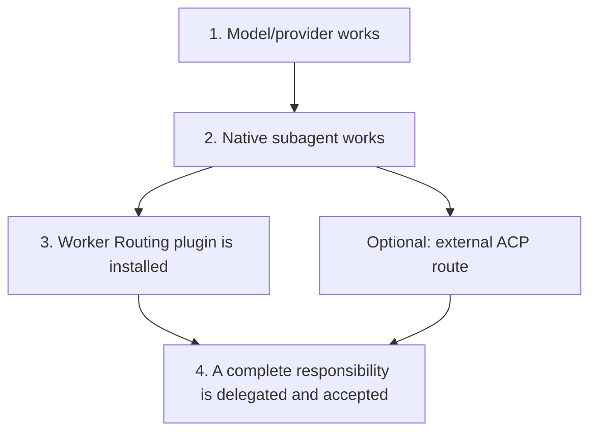

# From zero to a first successful delegated task

English | [中文](first-delegated-task.md)

This guide separates five layers that are easy to confuse. You do not need ACP or
a custom agent file to start; native Codex subagents are enough for most users.



Each observation proves only its own layer:

| Evidence | Proves | Does not prove |
| --- | --- | --- |
| Model appears in the picker | Catalog/UI wiring works | API key, a real request, or subagent availability |
| Main session completes one request | Provider, key, and model id basically work | Native child inventory or ACP works |
| Codex spawns a child | Native multi-agent path works | Worker Routing is installed |
| Plugin appears in `codex plugin list` | An installed copy is registered | The current session loaded it or every task will delegate |
| Worker reports completion | The worker claims completion | The diff is correct, tests passed, or the coordinator accepted it |
| ACP `run` returns a receipt | One turn on that route ended | Every provider, workspace, or native route works |

## Path A: use a native Codex subagent

Current Codex releases enable subagent tools by default; `[agents].enabled = false`
turns them off. Without an explicit model, a child inherits the parent model and
reasoning effort. The model inventory and explicit spawn overrides still depend on
the current Codex host and version.

Start with a read-only check in a repository that is safe to inspect:

```text
Spawn one explorer to identify this repository's test entry points and main modules.
Do not edit files. Wait for it, then integrate its evidence into a short explanation.
```

The native delegation path is established when a real child appears, returns a
result, and the main session integrates it. A model appearing in the main picker
does not guarantee that it appears in the subagent model-override inventory; that is
a separate host/multi-agent capability.

To configure a default child model in the user-level `config.toml`:

```toml
[agents]
enabled = true
default_subagent_model = "example/model-id"
default_subagent_reasoning_effort = "medium"
```

First verify that the model works and supports the selected effort. See
[custom native model picker](native-model-picker.en.md) for custom API setup.

## Path B: install Worker Routing for delegation policy

Worker Routing is an instruction-only plugin. It does not create models, store keys,
or implement the Codex subagent runtime. It gives the coordinator rules for
responsibility boundaries, work orders, continuation, rework, and acceptance.

First open this repository in Codex and have the built-in plugin-creator register
the plugin in your own personal marketplace. This is the same step as the README
installation; there is no second installation mechanism:

```text
Install this repository's plugins/worker-routing plugin into my personal
marketplace, and keep my current main model and provider configuration.
For updates, use the cachebuster and a normal reinstall.
```

`personal` is the name of the locally registered marketplace this example uses;
complete this step first so the native commands below have something to add. Once
registration succeeds, inspect the native registration state:

```bash
codex plugin add worker-routing@personal --json
codex plugin list --marketplace personal --json
```

Then open a new session to confirm the current session actually loaded the plugin,
and give it a medium-sized responsibility with a concrete finish:

```text
Fix the CSV import failure caused by blank rows and add a check that reproduces it.
You may delegate investigation, implementation, and focused validation to one worker;
inspect the real diff and test result before the final delivery.
```

A good first run has observable behavior:

1. The coordinator assigns investigation, fix, and focused validation as one coherent responsibility.
2. The coordinator does not duplicate the same implementation while the worker owns it.
3. Rework continues the same child when possible instead of starting over.
4. The coordinator inspects the real diff and relevant checks before delivery.

`solo`, `work on this yourself`, or `do not delegate` keeps the work in the main
session. Tiny tasks may also stay local because handoff costs more than it saves.
Plugin activation does not mean every request should spawn a worker.

## Path C: explicitly use an external ACP worker

Use this path only when an external ACP agent is already registered and its own
persistent session is useful. It sits beside native subagents rather than replacing
paths A or B.

```text
Ordinary delegation
  -> native Codex child

Operator explicitly selects a registered ACP route
  -> acp-worker skill
  -> cwr-acp
  -> external ACP agent
```

ACP route configuration, worker home, API keys, adapter, and exact workspace
allowlist stay outside Git. Run the account-free synthetic tests in
`integrations/acpx` before registering a live route. The schema, commands, and
recovery contract are in [ACP integration](acp-integration.md).

For the first live ACP acceptance, use a clean small repository. Ask the worker to
edit one function, add one focused check, and run it; then add one rework condition
through the same integration session. The coordinator inspects the real diff. Do not
use a private main checkout, hidden context, or an expensive write task merely to see
whether a route connects.

`--permissions read|full` chooses how cwr-acp answers ACP permission requests; it is
not an OS filesystem sandbox. A dedicated `workerHome`, a separate worktree, and a
real sandbox are also distinct boundaries.

## Locate the failing layer first

| Symptom | Check first |
| --- | --- |
| Model missing from picker | `model_catalog_json`, catalog visibility, and Codex restart |
| Model is visible but the main request fails | Provider base URL, Responses compatibility, key, and model id |
| Main request works but a child cannot spawn | `[agents]`, host multi-agent tools, and model inventory |
| Native child works but delegation policy is absent | Plugin installation, new-session loading, and whether the task repays handoff |
| ACP route is missing or rejects the workspace | Operator route config, enabled state, and exact workspace allowlist |
| ACP `continue` fails | Original session handle, route fingerprint, and adapter session recovery |
| Worker says done but the repository did not change | Permission/work directory, actual diff, and coordinator acceptance |

Use complete state labels. Source changed, commit created, push completed, plugin
installed, current session loaded, real provider turn succeeded, and owner accepted
are separate facts.

Use OpenAI's current [Subagents](https://developers.openai.com/codex/subagents/)
documentation for the native configuration. See [input boundaries](context.md) and
[installation and recovery](installation.md) for this repository's deeper contracts.
