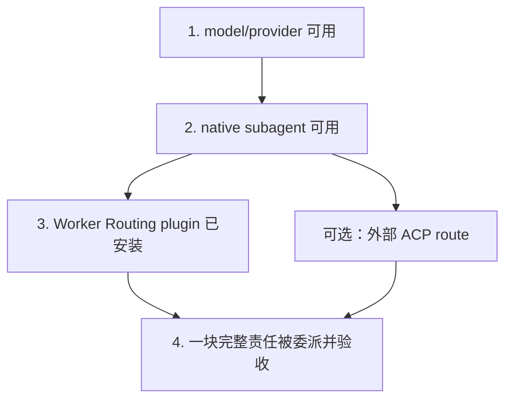

# 从零到第一次成功派工

[English](first-delegated-task.en.md) | 中文

这页把最容易混在一起的五层拆开。你不需要先安装 ACP，也不需要先写自定义 agent；
多数使用者从 native Codex subagent 开始就够了。



每层只证明自己的事：

| 证据 | 能证明 | 不能证明 |
| --- | --- | --- |
| model 出现在 picker | catalog/UI 已接通 | API key、真实请求或 subagent 可用 |
| 主 session 完成一次请求 | provider、key、model id 基本可用 | native child inventory 或 ACP 可用 |
| Codex 能 spawn 一个 child | native multi-agent 路径可用 | Worker Routing plugin 已安装 |
| plugin 出现在 `codex plugin list` | installed copy 已登记 | 当前 session 已加载它或一定会派工 |
| worker 返回“完成” | worker 声称完成 | diff 正确、测试通过或主 agent 已验收 |
| ACP `run` 返回 receipt | 该 route 的一次 ACP turn 结束 | 任意 provider、任意 workspace 或 native 路线都可用 |

## 路线 A：只用 native Codex subagent

Codex 当前默认启用 subagent tools；用户配置里 `[agents].enabled = false` 才会关闭。
没有单独指定 model 时，child 继承 parent 的 model 与 reasoning effort；宿主暴露的
model inventory 和显式 spawn override 仍以当前 Codex 版本为准。

先在一个可以安全读取的 repo 里做最小验证：

```text
请派一个 explorer，只调查这个仓库的测试入口和主要模块，不改文件。
等它完成后，把它的证据整合成一段简短说明。
```

看到 child 真实出现、返回结果，并由主 session 整合，才算 native delegation 路径
成立。仅仅在 main picker 里看到某个 model，不等于它一定会出现在 subagent 的 model
override inventory；那是独立的 host/multi-agent capability。

如果要设置默认 child model，可以在用户级 `config.toml` 写：

```toml
[agents]
enabled = true
default_subagent_model = "example/model-id"
default_subagent_reasoning_effort = "medium"
```

先确认该 model 真实可用且支持所选 effort。自定义 API model 的 provider 与 picker
配置见[自定义 native model picker](native-model-picker.md)。

## 路线 B：安装 Worker Routing，让主 agent 判断何时派工

Worker Routing 是 instruction-only plugin。它不创建 model、不保存 key，也不替 Codex
实现 subagent runtime；它给主 agent 一套责任划分、工单、续做和验收规则。

先在 Codex 中打开本仓库，让内置 plugin-creator 把插件注册到使用者自己的 personal
marketplace。这一步与 README 的安装步骤相同，没有第二种安装机制：

```text
请把本仓库 plugins/worker-routing 安装到我的 personal marketplace，
保持当前主模型和 provider 配置。更新时使用 cachebuster 与正常 reinstall。
```

`personal` 是这个例子使用的、已经在本机注册好的 marketplace 名称；先完成这一步，下面的
原生命令才有可添加的对象。注册完成后再核对登记状态：

```bash
codex plugin add worker-routing@personal --json
codex plugin list --marketplace personal --json
```

看到登记成功后新开一个 session，确认当前 session 真的加载了插件，再给它一块有明确结束
条件的中等责任：

```text
修复 CSV 导入时空行导致的失败，并补一个能复现问题的检查。
可以把导入模块的调查、修复和自测交给一个 worker；你负责检查真实 diff、运行结果和最终交付。
```

好的第一次派工应当能观察到：

1. 主 agent 把“调查 + 修复 + 自测”作为一块责任交给同一个 worker；
2. 主 agent 不在 worker 运行时重复实现同一块代码；
3. 需要返修时继续同一个 child，而不是无故重开；
4. 主 agent 最后检查实际 diff 与相关测试，再向用户交付。

`solo`、`亲自做`、`别派小弟` 会让主 agent 保持本线程执行。微小工作也可能不派，
因为交接成本会超过收益。plugin 生效不等于每条请求都应该 spawn。

## 路线 C：显式使用外部 ACP worker

只有在你已经登记外部 ACP agent，并希望保留它自己的 persistent session 时，才需要
这条路线。它与 native subagent 并列，不替换路线 A/B。

```text
普通派工
  -> native Codex child

operator 明确选择已登记 ACP route
  -> acp-worker skill
  -> cwr-acp
  -> external ACP agent
```

ACP route config、worker home、API key、adapter 和 exact workspace allowlist 都留在
Git 外。先完成 `integrations/acpx` 的无账号合成测试，再登记真实 route；具体 schema、
`run` / `continue` / `status` / `cancel` / `close` 与恢复边界见
[ACP integration](acp-integration.md)。

第一次真实 ACP 验收使用一个干净的小 repo：让 worker 修改一个小函数、补一条检查、
运行测试，再用同一个 integration session 增加一条返修要求。主 agent 检查实际 diff。
不要拿私人主 checkout、隐藏上下文或昂贵写任务当作“看看 route 通不通”的探针。

`--permissions read|full` 只是 cwr-acp 对 ACP permission request 的应答策略，不是 OS
filesystem sandbox。独立 `workerHome`、独立 worktree 与真正 sandbox 也是三件不同的事。

## 出错时先定位哪一层

| 现象 | 先查 |
| --- | --- |
| picker 没有 model | `model_catalog_json`、catalog visibility、Codex restart |
| picker 有 model，但主请求失败 | provider base URL、Responses compatibility、key、model id |
| 主请求成功，但不能 spawn child | `[agents]`、当前 host 的 multi-agent tools 与 model inventory |
| native child 可用，但主 agent 从不按预期派工 | plugin 是否安装、是否在新 session 加载、任务是否值得交接 |
| ACP route 找不到或拒绝 workspace | Git 外 route config、enabled 状态、exact workspace allowlist |
| ACP `continue` 失败 | 原 session handle、route fingerprint、adapter 是否能恢复旧 session |
| worker 说完成但 repo 没变化 | 权限/工作目录、worker 实际 diff，以及主 agent 是否做了验收 |

把状态词说完整：source 已改、commit 已产生、push 已完成、plugin 已安装、当前 session
已加载、真实 provider turn 已成功、owner 已验收，都是不同事实。

官方 subagent 配置以 OpenAI 的
[Subagents](https://developers.openai.com/codex/subagents/) 文档为准。本仓库的上下文和
隐私边界见[输入边界](context.md)，安装/恢复见[安装与恢复](installation.md)。
