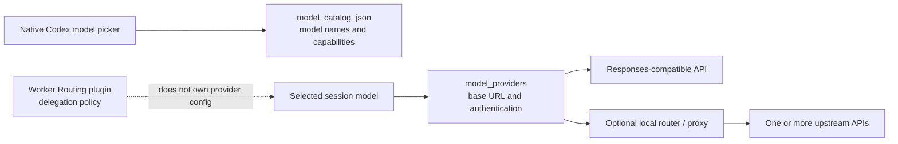

# Add a custom API model to the native Codex model picker

This is an independent configuration example, not a Worker Routing prerequisite.
Worker Routing decides when and how to delegate an engineering responsibility. It
does not store API keys, proxy model traffic, or choose a provider, router, or model.

Codex custom-model setup has two separate layers:



The key compatibility boundary is the wire protocol. Codex custom providers
currently use the Responses API. A service that implements only
`/chat/completions` is not enough, even if it calls itself OpenAI-compatible. The
upstream must implement `/responses`, or a proxy/router must translate the protocol.
The only currently supported custom-provider value is `wire_api = "responses"`.

## 1. Register a provider

Put provider configuration in the user-level `$CODEX_HOME/config.toml`:

- macOS / Linux: `~/.codex/config.toml`
- Windows: `%USERPROFILE%\.codex\config.toml`

Do not put a provider or key in a repository's `.codex/config.toml`. Codex ignores
project-level `model_provider` and `model_providers` values so a repository cannot
redirect credentials to its own endpoint.

Set an environment variable for the process that will start Codex:

```bash
# macOS / Linux; inherited only by processes started from this shell
export EXAMPLE_API_KEY='replace-with-your-key'
codex app
```

```powershell
# Windows PowerShell; inherited only by this shell and its child processes
$env:EXAMPLE_API_KEY = 'replace-with-your-key'
codex app
```

An OS credential/environment manager is also suitable. Do not put a real key in
`config.toml`, a model catalog, a repository, or a screenshot. A Codex app started
from Finder, the Dock, or the Start menu may not inherit a variable set in a terminal.

Add these root keys before any TOML tables in the user-level `config.toml`:

```toml
# TOML root keys must appear before [tables].
model = "example/model-id"
model_provider = "example"

[model_providers.example]
name = "Example Responses API"
base_url = "https://api.example.com/v1"
env_key = "EXAMPLE_API_KEY"
wire_api = "responses"
```

| Field | Responsibility |
| --- | --- |
| `model` | Default model id sent to the endpoint. It must match the id accepted by the upstream or router. |
| `model_provider` | Selects one provider table. |
| `base_url` | API root; Codex sends Responses API requests to it. |
| `env_key` | Name of the environment variable holding the bearer token, not the token itself. |
| `wire_api` | Codex currently supports `responses`; spelling it out makes the dependency explicit. |

This is enough to choose the id with `-m example/model-id`. Add a model catalog to
give it a friendly name and capability metadata in the native picker.

## 2. Add a native-picker catalog entry

`model_catalog_json` is an absolute path loaded at startup. A one-entry catalog
replaces the bundled catalog for that process. To retain bundled models, export the
catalog from the installed Codex version and append the custom entry to its `models`
array:

```bash
codex debug models --bundled > ~/.codex/model-catalog.json
```

Windows PowerShell:

```powershell
codex debug models --bundled | Out-File -Encoding utf8 "$HOME\.codex\model-catalog.json"
```

For a one-model setup, this conservative example intentionally advertises no image,
reasoning, parallel-tool, or native `apply_patch` support:

```json
{
  "models": [
    {
      "slug": "example/model-id",
      "display_name": "Example Model",
      "description": "Custom model behind a Responses-compatible endpoint.",
      "default_reasoning_level": null,
      "supported_reasoning_levels": [],
      "shell_type": "unified_exec",
      "visibility": "list",
      "supported_in_api": true,
      "priority": 1,
      "availability_nux": null,
      "upgrade": null,
      "base_instructions": "You are a coding agent. Follow the user's instructions and use the provided tools.",
      "support_verbosity": false,
      "default_verbosity": null,
      "apply_patch_tool_type": null,
      "truncation_policy": {
        "mode": "tokens",
        "limit": 10000
      },
      "context_window": 128000,
      "experimental_supported_tools": [],
      "input_modalities": ["text"],
      "supports_parallel_tool_calls": false
    }
  ]
}
```

Point the user config at it with a root key placed before all `[tables]`:

```toml
# macOS / Linux example
model_catalog_json = "/home/alice/.codex/model-catalog.json"
```

```toml
# Windows example; forward slashes avoid TOML backslash escaping
model_catalog_json = "C:/Users/Alice/.codex/model-catalog.json"
```

The catalog describes actual runtime compatibility. Add reasoning levels, image
input, parallel tools, web search, or `apply_patch_tool_type` only when both the
upstream and any proxy really support them. Overstated capabilities usually defer
the failure until a real request. `base_instructions` also affect coding behavior;
production configuration should use instructions that match the model and tool
protocol instead of blindly copying another model's internal metadata.

The catalog schema changes as Codex evolves. A durable workflow is to run
`codex debug models --bundled` with the installed version, copy the closest public
model entry, and adjust capability fields conservatively.

## 3. Verify each layer

First check that the current binary can parse the config and catalog. This does not
prove that the upstream works:

```bash
codex debug models > /tmp/codex-models.json
```

Windows PowerShell:

```powershell
codex debug models | Out-File -Encoding utf8 "$env:TEMP\codex-models.json"
```

Confirm that the output has the real model id as `slug`, `visibility` is `list`,
`supported_in_api` is `true`, and no catalog parse error was reported.

Fully quit and reopen Codex next. The app/app-server reads `model_catalog_json` at
startup, so editing the file without restarting may leave an old picker snapshot.
Picker visibility proves only catalog and UI wiring.

Finally run a minimal request that calls the API and may incur provider charges:

```bash
codex exec -m example/model-id 'Reply with exactly: OK'
```

Success proves that this process received the key, the endpoint accepted a Responses
request, and the model id routed correctly. Coding tools, long context, images,
continuation, and subagent use still need separate task-level acceptance.

## 4. Multiple providers and a local router

`model_provider` is selected for the session; a catalog entry does not carry its own
provider id. Multiple upstream providers therefore have two straightforward layouts:

1. Use one Codex profile per provider and choose a profile at startup.
2. Connect Codex to one local router and route model slugs to different upstreams.

The second layout puts several API models in one native picker:

```text
Native Codex picker
  -> one local Responses endpoint
  -> route by model slug
  -> provider A / provider B / local model
```

Upstream keys, subscription priorities, fallback policy, and model mappings belong
in operator-owned local configuration outside Git. Worker Routing neither reads nor
chooses them. It consumes native worker capability already exposed by the host, or an
independently registered ACP route when the operator explicitly enables one.

## 5. Common failures

| Symptom | Check first |
| --- | --- |
| Catalog parse error | Required fields and enum values for the installed Codex version; rebuild from `codex debug models --bundled`. |
| Model missing from picker | `visibility: "list"`, `supported_in_api: true`, the absolute path, and whether the app/app-server really restarted. |
| `401` or missing key | `env_key` spelling and whether the process that launched Codex inherited the variable. |
| `404` or unknown model | Whether `slug` exactly matches the id accepted by the upstream/router. |
| Endpoint rejects `/responses` | The upstream only implements Chat Completions; add a translating proxy/router or use a Responses-compatible endpoint. |
| Chat works but edits fail | Catalog tool claims, provider function/custom-tool compatibility, and model instructions do not match. |
| Main picker works but a subagent cannot select the model | Subagent inventory and multi-agent compatibility are a separate host layer; picker config does not register a `spawn_agent` override. |

## 6. Remove the custom setup

Remove or restore these root keys in the user-level `config.toml`:

```toml
model = "example/model-id"
model_provider = "example"
model_catalog_json = "/absolute/path/to/model-catalog.json"
```

Remove the corresponding `[model_providers.example]` table, then fully quit and
reopen Codex. The catalog file may remain as a local backup; it should contain no key.

Refer to OpenAI's current [Advanced Configuration](https://developers.openai.com/codex/config-advanced/)
and [Configuration Reference](https://developers.openai.com/codex/config-reference/)
for the authoritative field definitions.
