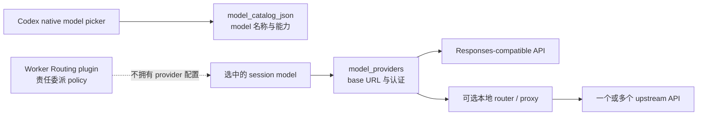

# 把自定义 API model 接进 Codex native model picker

这是一份独立的配置例子，不是 Worker Routing 的安装前提。Worker Routing 只决定
何时、怎样交出一块工程责任；它不提供 API key，不代理模型请求，也不规定使用哪家
provider、router 或 model。

Codex 的自定义 model 接入分成两层：



最关键的边界是：当前 Codex custom provider 使用 `responses` wire API。一个只实现
`/chat/completions` 的“OpenAI-compatible”服务还不够；需要让上游本身实现
`/responses`，或在中间放一层会做协议转换的 proxy/router。官方当前只接受
`wire_api = "responses"`。

## 1. 先登记 provider

provider 配置应写在用户级 `$CODEX_HOME/config.toml`；默认位置是：

- macOS / Linux：`~/.codex/config.toml`
- Windows：`%USERPROFILE%\.codex\config.toml`

不要把 provider 或 key 写进项目的 `.codex/config.toml`。Codex 会忽略项目层的
`model_provider` / `model_providers`，避免仓库把凭据发送到它指定的 endpoint。

先给当前 Codex 进程设置一个环境变量：

```bash
# macOS / Linux；只对由这个 shell 启动的后续进程生效
export EXAMPLE_API_KEY='replace-with-your-key'
codex app
```

```powershell
# Windows PowerShell；只对当前 PowerShell 及其后续进程生效
$env:EXAMPLE_API_KEY = 'replace-with-your-key'
codex app
```

把 key 交给系统 credential/environment manager 也可以。不要把真实 key 写进
`config.toml`、model catalog、仓库或截图。若从 Finder、Dock 或开始菜单启动 Codex，
确认该 GUI 进程确实能继承对应环境变量；终端里 `echo` 得到 key 不能证明 GUI 看得到。

在用户级 `config.toml` 的顶层 table 之前加入：

```toml
# TOML 顶层键必须放在 [table] 之前。
model = "example/model-id"
model_provider = "example"

[model_providers.example]
name = "Example Responses API"
base_url = "https://api.example.com/v1"
env_key = "EXAMPLE_API_KEY"
wire_api = "responses"
```

这里各字段的职责很窄：

| 字段 | 作用 |
| --- | --- |
| `model` | 默认发给 endpoint 的 model id。必须与上游或 router 接受的 id 一致。 |
| `model_provider` | 选择下方哪一个 provider table。 |
| `base_url` | API 根地址；Codex 会按 Responses API 发送请求。 |
| `env_key` | 保存 bearer token 的环境变量名，不是 token 本身。 |
| `wire_api` | 当前只支持 `responses`；写出来能让例子的依赖更明确。 |

只做这一步，CLI 已经可以用 `-m example/model-id` 选择 model；要让它以友好的名称和
能力元数据出现在 native picker，还要增加 model catalog。

## 2. 给 native picker 增加 model catalog

`model_catalog_json` 是一个启动时读取的绝对路径。一个只有单条 model 的 catalog 会
替换当前进程使用的 bundled catalog；如果还想保留 Codex 自带的 models，先导出当前
bundled catalog，再向它的 `models` 数组追加自定义条目：

```bash
# macOS / Linux：尊重 CODEX_HOME，缺失时回退到 ~/.codex
codex_home="${CODEX_HOME:-$HOME/.codex}"
# noclobber 只在子 shell 内生效，已有自定义 catalog 时拒绝覆盖
( set -C; codex debug models --bundled > "$codex_home/model-catalog.custom.json" )
```

Windows PowerShell：

```powershell
# Windows PowerShell 5.1 与 PowerShell 7 通用：显式写出 UTF-8 无 BOM。
# Windows PowerShell 5.1 的 `utf8` 会写 BOM，PowerShell 6+ 的 `utf8` 无 BOM；
# catalog 是 JSON，BOM 会让解析失败，所以用 .NET UTF8Encoding($false)。
$codexHome = Join-Path $HOME '.codex'
if ($env:CODEX_HOME) { $codexHome = $env:CODEX_HOME }
$catalog = Join-Path $codexHome 'model-catalog.custom.json'
if (Test-Path -LiteralPath $catalog) { throw "Refusing to overwrite existing $catalog" }
$json = codex debug models --bundled | Out-String
$utf8 = New-Object System.Text.UTF8Encoding($false)
[System.IO.File]::WriteAllText($catalog, $json, $utf8)
```

两个示例都导出到 `model-catalog.custom.json` 这个独立文件名，不会静默替换已有的
`model-catalog.json`；如果文件已存在，命令会直接失败而不是覆盖。两个示例也都尊重
`CODEX_HOME`（Windows 为 `$env:CODEX_HOME`），缺失时回退到 `$HOME` 下的默认位置；之后的
`model_catalog_json` 就指向这一步选定的那个路径。

若只需要一个自定义 model，可以从下面这份保守的最小例子开始。它故意不宣称 image、
reasoning、parallel tools 或 native `apply_patch` 能力：

```json
{
  "models": [
    {
      "slug": "example/model-id",
      "display_name": "Example Model",
      "description": "Custom model behind a Responses-compatible endpoint.",
      "default_reasoning_level": null,
      "supported_reasoning_levels": [],
      "shell_type": "unified_exec",
      "visibility": "list",
      "supported_in_api": true,
      "priority": 1,
      "availability_nux": null,
      "upgrade": null,
      "base_instructions": "You are a coding agent. Follow the user's instructions and use the provided tools.",
      "support_verbosity": false,
      "default_verbosity": null,
      "apply_patch_tool_type": null,
      "truncation_policy": {
        "mode": "tokens",
        "limit": 10000
      },
      "context_window": 128000,
      "experimental_supported_tools": [],
      "input_modalities": ["text"],
      "supports_parallel_tool_calls": false
    }
  ]
}
```

然后在 `config.toml` 的顶层、所有 `[table]` 之前增加绝对路径：

```toml
# macOS / Linux example
model_catalog_json = "/home/alice/.codex/model-catalog.custom.json"
```

```toml
# Windows example；正斜杠可避免 TOML 反斜杠转义
model_catalog_json = "C:/Users/Alice/.codex/model-catalog.custom.json"
```

上面的路径要与导出时的选择一致：若设置了 `CODEX_HOME` / `$env:CODEX_HOME`，就换成它下面
的那个 `model-catalog.custom.json`，不要把路径硬编码到别人的 profile。

catalog 描述的是 Codex 应怎样对待这个 model，不是宣传文案。只有 upstream 和所用
proxy 确实支持时，才加入 reasoning levels、image input、parallel tool calls、web
search 或 `apply_patch_tool_type`。虚报能力通常不会让能力凭空出现，只会把错误推迟到
真实请求阶段。`base_instructions` 也会直接影响 coding 行为；生产配置应使用与该 model
及工具协议相匹配的 instructions，而不是无条件复制另一个 model 的内部 metadata。

model catalog schema 会随 Codex 版本演进。比长期保存一份别人机器上的完整 catalog
更稳妥的做法，是用自己当前版本的 `codex debug models --bundled` 取得基线，再复制一
个最接近的公开 model 条目并保守调整能力字段。

## 3. 验证每一层

先验证配置和 catalog 能被当前 binary 解析；这个命令不会证明 upstream 可用：

```bash
codex debug models > /tmp/codex-models.json
```

Windows PowerShell：

```powershell
# 同样显式 UTF-8 无 BOM，避免 5.1 的 `utf8` BOM 破坏 JSON 解析
$diagnostic = Join-Path $env:TEMP 'codex-models.json'
$json = codex debug models | Out-String
$utf8 = New-Object System.Text.UTF8Encoding($false)
[System.IO.File]::WriteAllText($diagnostic, $json, $utf8)
```

在输出里确认：

- `slug` 是真实 model id；
- `visibility` 是 `list`；
- `supported_in_api` 是 `true`；
- catalog 没有 parse error。

接着完全退出并重新打开 Codex。`model_catalog_json` 在 app/app-server 启动时读取；只改
文件但不重启，picker 可能继续显示旧 snapshot。看到 model 出现在 picker，只证明
catalog 和 UI 路径成立。

最后再做一次会实际调用 API、可能产生费用的最小请求：

```bash
codex exec -m example/model-id 'Reply with exactly: OK'
```

它成功后，才证明当前进程拿到了 key、provider endpoint 接受 Responses request，且
model id 能正确路由。coding tools、长上下文、图片、续做和 subagent 仍分别需要真实
任务验收。

## 4. 多 provider 与本地 router

Codex 的 `model_provider` 是 session 级选择；catalog entry 本身不携带 provider id。
因此，多家 upstream 有两种简单组织方式：

1. 每个 provider 使用一个 Codex profile，启动时显式选择 profile；
2. 让 Codex 只连接一个本地 router，router 再按 `slug` 把不同 model 转到不同 upstream。

第二种就是常见的“一个 native picker 放多个 API models”方案：

```text
Codex native picker
  -> one local Responses endpoint
  -> route by model slug
  -> provider A / provider B / local model
```

router 的 upstream key、套餐优先级、fallback 与 model 映射属于 operator 的本地配置，
应留在 Git 外。Worker Routing 不读取或决定这些值；它只消费宿主已经暴露的 native
worker 能力，或在 operator 明确登记时使用独立 ACP route。

## 5. 常见失败

| 现象 | 优先检查 |
| --- | --- |
| catalog parse error | 当前 Codex 版本要求的字段或 enum；从 `codex debug models --bundled` 的当前条目重建。 |
| picker 没有新 model | `visibility: "list"`、`supported_in_api: true`、绝对路径，以及 app/app-server 是否真正重启。 |
| `401` / missing key | `env_key` 拼写与启动 Codex 的那个进程是否继承了变量。 |
| `404` / unknown model | `slug` 是否与 upstream/router 接受的 model id 完全相同。 |
| endpoint 不认识 `/responses` | 上游只有 Chat Completions；增加协议转换 proxy/router，或换 Responses-compatible endpoint。 |
| model 能对话但不能可靠编辑 | catalog 声明的 tool 能力、provider 的 function/custom tool 兼容性和 model instructions 不匹配。 |
| main picker 可选，但 subagent 里不可选 | 这是另一层 host/multi-agent inventory；picker 配置本身不会替 `spawn_agent` 注册 model override。 |

## 6. 撤销

从用户级 `config.toml` 删除或改回以下顶层键：

```toml
model = "example/model-id"
model_provider = "example"
model_catalog_json = "/absolute/path/to/model-catalog.json"
```

再删除对应 `[model_providers.example]` table，完全退出并重开 Codex。catalog 文件本身
可以保留作本机备份；它不应包含 key。

当前字段以 OpenAI 的 [Advanced Configuration](https://developers.openai.com/codex/config-advanced/)
和 [Configuration Reference](https://developers.openai.com/codex/config-reference/) 为准。
